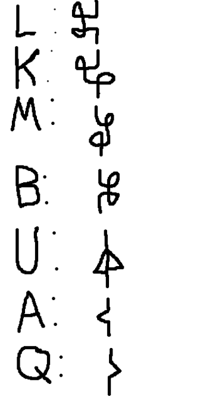
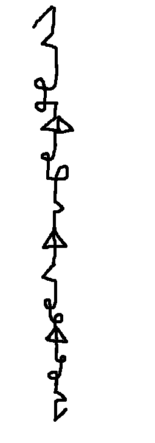
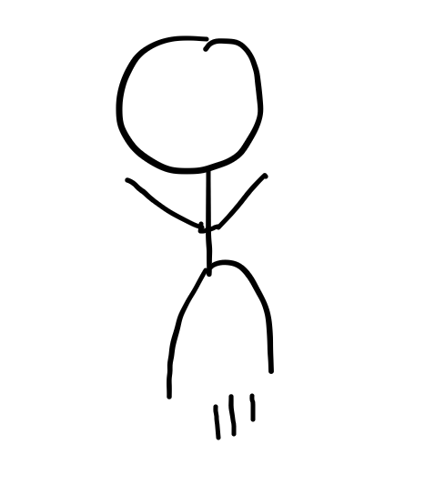
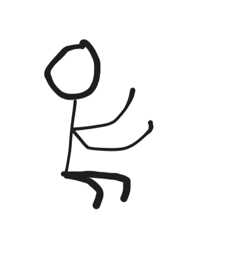

# Introduction

After I made my conlang "Limit" (which was kinda mid), and then planned out "Proto-Zorbbbb" (I'm working on it), I felt that I needed to make something better.

It's probably not better because, (a) it's based on [_Infinite Craft_](https://neal.fun/infinite-craft/) which everyone was obsessed with in 2023, and (b) it took like 5 minutes to make.

So, enjoy!

# Craftic

"Craftic" is an exonym. The endonym is this:

satatatatatabuloqutabuloqoquloqutatabuloqutabulqoqoqutatatatabulqutabuloqoquloqutatabuloqutabuloqoqoqoqutabutatatabuloqutabuloqo
quloqoqoqutatatatatatatabuloqutabuloqoquloqutatabuloqutabuloqoqoqutatatatabuloqutabuloqoquloqutatabuloqutabuloqoqoqoqutabutatata
buloqutabuloqoquloqoqoqutatatatatabuloqutabuloqoquloqutatabuloqutabuloqoqoqutatatatabuloqutabuloqoqulqutatabuloqutabuloqoqoqoqoqe

## Nouns (and noun phrases) (derived from phonology)

All nouns are derived from Infinite Craft. 
Note that phonemes have no extra allophones, and would just be pronounced like how they would if the same symbol was written in square brackets.
Sound and written representation: 
l (/ɬ/) = water
k (/ʞ/) = fire
m (/m/) = wind
b (/ʙ/) = earth
u (/y/) = plus
a (/a/) = start parentheses
q (/ħ/) = end parentheses

Each phoneme is also a morpheme, you're welcome!

If there are any adjacent vowels, put a [t] between them, and if there are any adjacent consonants, put an [o] between them (very restrictive CV phonotactics). If a vowel starts a word, add a [ç], written as "s", and if a consonant ends a word, add an [œ], written as "e". 

Parentheses are required for adding any units that aren't fundamental.

There is communtative property symmetry, where both ways to put two things together are valid with the same meaning (so a non-one-to-one mapping).

Cloud = [Steam] + [Smoke] = [Water + Fire] + [Fire + Wind] = salukoqutakumoqe

Oh yeah, I should have mentioned that you'll sound insane if you try to pronounce anything. 

### Actual Noun Orthography

An alphabet (top/down) is used in actual Craftic, the romanization is just for simplification. Here is the key:

{.lightbox}.

As you can see, all the letters start and end with the same shape. This allows for a word to be transcribed without lifting your pen, so it is continuous (however, the curve is not differentiable because some letters contain sharp turns). [t] and [o], as well as [ç] and [œ], don't have their own glyphs, because they can be inferred when you read it - the environments and the sounds are one to one. At the start of a word, the first letter should start with a stroke going up-right before writing its normal variant, and at the end of a word, the last letter should end with another up-right stroke after writing its normal variant. 

This is what the word "cloud" (salukoqutakumoqe) looks like:

{.lightbox}.

## Verbs

All verbs must be expressed by actually doing them. If it is biologically impossible to do so, or you will get in trouble for doing so, then try your best to mimic the action by gesturing.

There are some agreed upon gestures that you shouldn't make your own of. For example, if others have already established the precedent that the verb "punch" is represented by punching the listener's face, you must also use that same gesture for that word. 

However, if others haven't yet invented the gesture for a certain word, you may take the opportunity to seize the "First Discovery", like how it works in Infinite Craft, and invent your own gesture for it. 

For orthographical purposes, all verbs are pictogram representations of what they mean, usually involving a stick figure as a placeholder for the subject. For example, the word "jump" is written as this: {.lightbox}. 

What if there is an object? Craftic doesn't actually distinguish between transitive and intransitive. Instead, if there is an object, it is treated as a subject, that accepts the verb "accepts". 

## Adjectives and Adverbs

So, adjectives and adverbs on their own don't really exist. 

If a noun phrase involving an adjective exists in Infinite Craft (like "little red book"), then you can just use that as a noun. 

Otherwise, just use a noun that the adjective is close to. For example, if you want to say "scary", say "monster" instead. Once a speaker coins a new match, that is what sticks forever. Adverbs work very similarly. Instead of saying "quickly", just say "cheetah". Both come before the thing they modify. 

## Prepositions

Prepositions can't really be expressed as words, but instead are shown through verbs.

"of" is expressed using "have", "in" and "from" are expressed using "exist", etc. 

## General Syntax

In speech, the verb gesture is performed at the same time as the subject, and is elongated for as long as it takes to finish pronouncing the subject. 

In writing, the subject is written on the top, letters horizontal and left to right, then the verb is written underneath. 

There aren't technically any grammatical case markings. The accusative and dative cases are their own pair with the verb "accept". The genitive case doesn't really exist.

By the way, the symbol for "accept" is this: 

{.lightbox}.

For comparing A to B in quality X, just say "A X, B ! X"

This is what "my evil cat from France eats yummier food than the dog" would look like:

I have
Villain cat accept
Villain cat exist
France accept
Villain cat eat
(Ice cream) food accept
Dog eat
(Brussels sprouts) food accept

# Conclusion

Please feel free to roast Craftic in the comments.