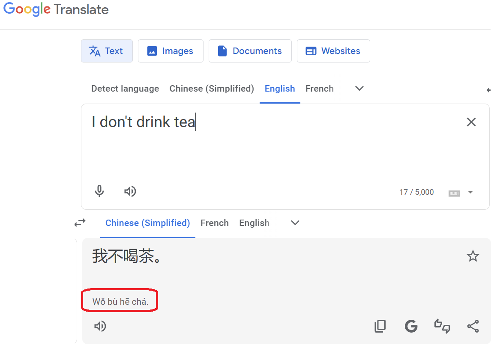

> This is a series of blogs on linguistics. See also: [_Phonology_](../Phonology/), [_Writing Systems_](../Writing-Systems/), [_Phonetics_](../Phonetics/)

# Morphology
## Confusing Introduction
Previously, in [orthographies](../Writing-Systems/index.qmd), [phonology](../Phonology/index.qmd), and [phonetics](../Phonetics/index.qmd), we've discussed *sounds* and their symbols. Now, we take a step further into *meaning*.

Now, I want to emphasize that GENERALLY, sound and meaning are two separate things. This should make sense if you think about it - the meaning of "meaning" is just the idea tied to that word, and the sound is how that word is pronounced. There is nothing about the voiced bilabial nasal /m/ or the closed front unrounded vowel /i/ that makes the word "meaning" tied to the idea of "the idea tied to that word". Note to reader: I do not apologize for provding confusing examples like this.

It may appear that there are exceptions. For example, the "wh" in English commonly indicates an interrogative word, like the five that are commonly referenced - "who", "what", "why", "where", "when". However, there's nothing about the labiovelar approximant that is inherently tied to interrogative words. Instead, that was just an arbitrary sound that happened to evolve this way. Instead of calling the "w" and the "h" as *phonemes*, we would call "wh" a unit that evolved out of a *morpheme*. 

A *morpheme* is loosely defined as a unit of meaning. You may wonder why we do not just use the term "words" to describe these. The answer is that "words" are quite hard to define - I mean, an app like Word or Google Docs might just measure the number of spaces and then add one, because that's generally convenient in English, but what about something like Mandarin? Would every sentence in Mandarin be a single "word" because there aren't any spaces? Such a question isn't easy or even helpful. Therefore, we use morphemes instead.

Since sound and meaning are independent, if your English teacher ever uses something like alliteration or rhyme to analyze a literary text, now you know that such an analysis is completely bogus. However, another possiblity also exists - your teacher is imagining how that sound is pronounced, and the manner and difficulty could add some "insightful" meaning (by which I mean that it's definitely not intended to be that deep, and any such annotation is surely a stretch).

## Types of Morphology Across Languages

There are two continuums that determine how a language's morphology works. The first measures how many morphemes are squished into a single word, and the second measures how clearly morphemes are separated. 

### Spectrum 1
The first continuum ranges from one morpheme per word to multiple morphemes put together in a word to entire sentences fit in a word. In that order, the types of languages would be analytic, synthetic, and polysynthetic. 

Analytic languages would be something like Mandarin - the sentence "I don't drink tea" would be "我不喝茶" ("Wǒ bù hē chá"). Each word is its own morpheme here. Purely analytic languages don't rely on *inflection*, or altering the form of words - instead, they rely on *particles*, which are words that are put next to other words to c
hange the grammatical meaning. 

As a sidenote, Google Translate clearly agrees that each character is a word in this case, as shown here. 

{.lightbox}

Synthetic languages actually inflect more and rely less on particles. For example, Latin uses verb conjugations and noun declensions to reflect gender, number, case, person, and more. As a result, it doesn't use articles, pronouns are optional, and there are less words in general. However, the entire sentence doesn't get smushed together, and you can still tell apart subjects, verbs, and objects.

Polysynthetic languages are like an extreme form of regular synthetic languages. A single word could contain the meaning of an entire sentence, combining morphemes of subjects, objects, and verbs. You may have seen super long words of some indigenous languages of the Eskimo-Aleut family in Greenland, Alaska, and Northern Canada (possibly on signs while playing GeoGuessr), and wondered what they were yapping. Now you know it's not actual yap, just a normal sentence put together into a giant word. 

But hold on, I thought words aren't reliable measurements, so why do we use words here? Here, linguists use the practical working definition of a word, which is essentially something that makes sense being separated and independent. For example, morphemes like affixes would just be considered part of that word, but adjectives would be their own word (at least, that's how English treats affixes and adjectives). So, it's not purely based on how they're written down, but there doesn't necessarily need to be a clean line either. It's just on average, how is the density of morphemes generally?

### Spectrum 2
The second continuum ranges from very clear distinction between morphemes to completely unique, unpredictable morphemes outlining certain features- agglutinative to fusional. 

An agglutinative language like Turkish clearly separates all of its morphemes. 
Take the "word" (more like sentence) "Evlerimizdenmişsiniz".

Breakdown:

Ev → "house" (root noun)

-ler → plural → Evler = "houses"

-imiz → our → Evlerimiz = "our houses"

-den → from → Evlerimizden = "from our houses"

-miş → hearsay/past tense → Evlerimizdenmiş = "it seems it was from our houses"

-siniz → second person plural → Evlerimizdenmişsiniz = "apparently you (all) were from our houses"

However, look at fusional languages. In Spanish, "hablamos" means "we speak", with the ending "-amos" indicating that the pronoun is first person, and also plural ("we"). If you just knew the first person ending that's not plural ("-o"), then you still wouldn't be able to derive the ending "-amos" from that. 

### Consonantal Root Systems

There is a feature in languages where the root meaning is carried out through the consonants, and the vowels between them just modify the meaning. This is pretty much unseen outside of Afro-Asiatic langauges.

Most famously, Semitic languages (a sub-branch of Afro-Asiatic) such as Arabic and Hebrew use the triconsonantal root system. In Arabic, for example, the root "k-t-b" has to do with writing and books. The word "kitab" means "book", the word "katib" means "writer", and the word "maktaba" means "library". 

Note that the extra consonant "m" in "maktaba" is added, because Arabic itself isn't purely consonantal, and uses affixes as well. Interestingly, the word "kitab" spread to many languages like Farsi or Hindi to mean "book", but since those languages aren't Semitic, they don't think of "kitab" using the triconsonantal root system, but rather just as any other word. 

Germanic languages like English do just *just* a little. Primarily, this is shown in tense changes, like "s*i*ng" -> "s*u*ng" -> "s*a*ng", or "r*u*n" -> "r*u*n" -> "r*a*n" as opposed to something like "reprimand" -> "reprimand*ed*" -> "reprimand*ed*", where the latter is regular. 

# Original Date

10/13/2025