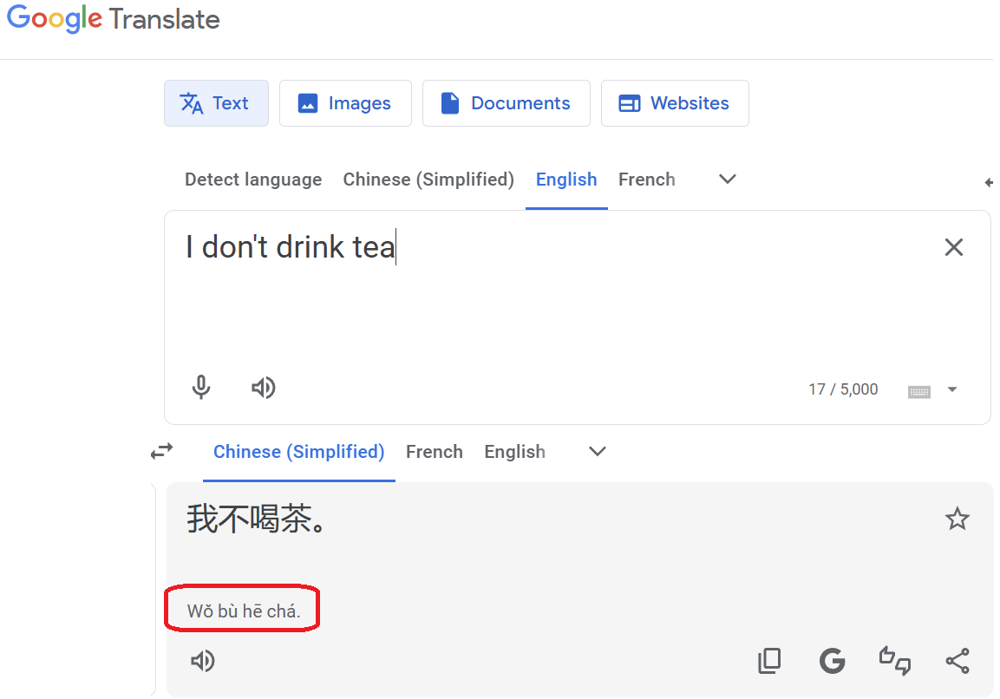

> This is a series of blogs on linguistics. See also: [_Phonology_](../Phonology/), [_Writing Systems_](../Writing-Systems/), [_Phonetics_](../Phonetics/)

# Confusing Introduction
Previously, in [orthographies](../Writing-Systems/index.qmd), [phonology](../Phonology/index.qmd), and [phonetics](../Phonetics/index.qmd), we've discussed *sounds* and their symbols. Now, we take a step further into *meaning*.

Now, I want to emphasize that GENERALLY, sound and meaning are two separate things. This should make sense if you think about it - the meaning of "meaning" is just the idea tied to that word, and the sound is how that word is pronounced. There is nothing about the voiced bilabial nasal /m/ or the closed front unrounded vowel /i/ that makes the word "meaning" tied to the idea of "the idea tied to that word". Note to reader: I do not apologize for provding confusing examples like this. 

## Definition

A *morpheme* is loosely defined as a unit of meaning. You may wonder why we do not just use the term "words" to describe these. The answer is that "words" are quite hard to define - I mean, an app like Word or Google Docs might just measure the number of spaces and then add one, because that's generally convenient in English, but what about something like Mandarin? Would every sentence in Mandarin be a single "word" because there aren't any spaces? And then polysynthetic language (like we'll see later) has the meaning of an entire sentence within a word - what about that? Such a question isn't easy or even helpful and it entirely depends on the culture surrounding that language. Therefore, we use morphemes instead.

Since sound and meaning are independent, if your English teacher ever uses something like alliteration or rhyme to analyze a literary text, now you know that such an analysis is completely bogus. However, another possiblity also exists - your teacher is imagining how that sound is pronounced, and the manner and difficulty could add some "insightful" meaning (by which I mean that it's definitely not intended to be that deep, and any such annotation is surely a stretch).

# Free and Bound Morphemes

There is also a difference between free and bound morphemes. *Free morphemes* can exist on their own, while *bound morphemes* can only exist attached to other morphemes. 

For example, look at the word "dogs". The "s" is a plural marker, but you can't have a plural marker on its own, so it is bound. Meanwhile, "dog" is free, because it is a word on its own.

# Allomorphy

Allomorphy is when the meaning of a morpheme may take on a different form based on the environment, just like how allophony is when the production of a phoneme may change based on the environment.

Allomorphs often occur as a result of the phonological environment. 

Take the words "ineffective", "imperfect", "illiterate", and "irrelevant". All of these prefixes have the exact same function - to negate "effective", "perfect", "literate", and "relevant", respectively. The prefix "in" seems to be the default one, because while "im" occurs before bilabials while "ir" and "il" occur before their corresponding liquids, "in" appears everywhere else. You can probably see how this emerged from phonological assimilation. Therefore, we call "im", "il", and "ir" as *allomorphs* of "in". 

Another example is comparatives. Have you noticed how "easy" as a comparative can either be "easier" (don't mind the spelling, since phonologically, the vowel doesn't change, and sandhi is another beast we don't need right now) or "more easy", but "difficult" as a comparative, at least to most people, should be "more difficult" and "difficulter" sounds ungrammatical? It's because "more" is required if the base form is at least three syllables - otherwise, either "more" or "er" is ok. This is also allomorphy, since they both make something a comparative but take different forms. 

## Types of Morphology Across Languages

When classifying different morphologies, there are few things to keep in mind. Let's look at them and zoom in. 

### Morphemes per word

The first continuum ranges from one morpheme per word to multiple morphemes put together in a word to entire sentences fit in a word. In that order, the types of languages would be analytic, synthetic, and polysynthetic. 

#### Analytic languages

Analytic languages would be something like Mandarin - the sentence "I don't drink tea" would be "我不喝茶" ("Wǒ bù hē chá"). Each word is its own morpheme here. Purely analytic languages don't rely on *inflection*, or altering the form of words - instead, they rely on *particles*, which are words that are put next to other words to change the grammatical meaning. 

As a sidenote, Google Translate clearly agrees that each character is a word in this case, as shown here. 

{.lightbox}

#### Synthetic Languages 

Synthetic languages actually inflect more and rely less on particles. For example, Latin uses verb conjugations and noun declensions to reflect gender, number, case, person, and more. As a result, it doesn't use articles, pronouns are optional, and there are less words in general. However, the entire sentence doesn't get smushed together, and you can still tell apart subjects, verbs, and objects.

#### Polysynthetic Languages

Polysynthetic languages are like an extreme form of regular synthetic languages. A single word could contain the meaning of an entire sentence, combining morphemes of subjects, objects, and verbs. You may have seen super long words of some indigenous languages of the Eskimo-Aleut family in Greenland, Alaska, and Northern Canada (possibly on signs while playing GeoGuessr), and wondered what they were yapping. Now you know it's not actual yap, just a normal sentence put together into a giant word. 

#### Clarification on "Words"

But hold on, I thought words aren't reliable measurements, so why do we use words here? Here, linguists use the practical working definition of a word, which is essentially something that makes sense being separated and independent. For example, morphemes like affixes would just be considered part of that word, but adjectives would be their own word (at least, that's how English treats affixes and adjectives). So, it's not purely based on how they're written down, but there doesn't necessarily need to be a clean line either. It's just thinking about the general density of morphemes. 

The idea of free and bound morphemes can also help to clarify this - bound morphemes obviously can't count as their own word, so it's basically asking how many bound morphemes there are compared to free morphemes. 

### Meanings per morpheme

Among synthetic and polysynthetic languages, we have a further division - how many units of meaning a morpheme can take. 

#### Agglutinative Languages

An agglutinative language like Turkish clearly separates all of its morphemes, which each have a single meaning. 

Take the "word" (more like sentence) "Evlerimizdenmişsiniz".

Breakdown:

Ev → "house" (root noun)

-ler → plural → Evler = "houses"

-imiz → our → Evlerimiz = "our houses"

-den → from → Evlerimizden = "from our houses"

-miş → hearsay/past tense → Evlerimizdenmiş = "it seems it was from our houses"

-siniz → second person plural → Evlerimizdenmişsiniz = "apparently you (all) were from our houses"

#### Fusional Languages

Now, look at fusional languages. In Spanish, "hablamos" means "we speak", with the ending "-amos" indicating that the pronoun is first person, and also plural ("we"). If you just knew the first person ending that's not plural ("-o"), then you still wouldn't be able to derive the ending "-amos" from that. 

In other words, the "-o" encodes plural, first person, and present tense all in one tiny morpheme, so it's called *fusional*. 

## Consonantal Root Systems

There is a feature in languages where the root meaning is carried out through the consonants, and the vowels between them just modify the meaning. This is pretty much unseen outside of Afro-Asiatic langauges.

Most famously, Semitic languages (a sub-branch of Afro-Asiatic) such as Arabic and Hebrew use the triconsonantal root system. In Arabic, for example, the root "k-t-b" has to do with writing and books. The word "kitab" means "book", the word "katib" means "writer", and the word "maktaba" means "library". 

Note that the extra consonant "m" in "maktaba" is added, because Arabic itself isn't purely consonantal, and uses affixes as well. Interestingly, the word "kitab" spread to many languages like Farsi or Hindi to mean "book", but since those languages aren't Semitic, they don't think of "kitab" using the triconsonantal root system, but rather just as any other word. 

Germanic languages like English do *just* a little. Primarily, this is shown in tense changes, like "s*i*ng" -> "s*u*ng" -> "s*a*ng", or "r*u*n" -> "r*u*n" -> "r*a*n" as opposed to something like "reprimand" -> "reprimand*ed*" -> "reprimand*ed*", where the latter is regular. 

# Merging Morphemes Subconsciously

Sometimes, a single morpheme could etymologically be derived from two other morphemes, but our brains treat it like a single morpheme due to semantic drifting.

For example, take the word "forgive". Etymologically, it was derived from "for" and "give". However, over time, the meaning of "forgive" stopped being derived from "for" and "give" individually. So, people perceive it as a single morpheme, because those historical morphemes don't contribute to the meaning of "forgive" anymore. 

# Affixes

Most languages' morphologies involve *affixes*, or morphemes being added to words. Here are the main types:

* Prefixes: Go before the word, like "un" in English to mean "not" (unhappy).
* Suffixes: Go after the word, like "s" in English to mean plural (dogs).
* Circumfixes: Go before and after the word, but the parts going on either side don't mean anything individually, like "ge...t" in German to form the past tense ("kaufen" -> "gekauft")
* Infixes: Go inside a word, like swear words in some people's English to make emphasis (abso-[bleep]ing-lutely)

# Note

One important thing to note is that trying to classify languages into categories like this isn't super helpful. Early ideas from linguistics are usually western concepts, because the languages linguists were studying were mostly Eurasian. 

As a result, these divisions between analytic and synthetic and agglutinative and fusional don't necessarily account for every single language. Arabic, for example, can't really be plotted with these alone, because a consonantal root system is way more complicated. 

There are many more morphological spectrums (like concatenative and non-concatenative, the latter of which Arabic falls into) that could exist as well, but these are just the most commonly used references ones.

# Inflection vs. Derivation

Morphemes fall into two types. *Inflection* (as we've seen for synthetic languages) means the word still has the same part of speech (AHH, SYNTAX!!!) and something else has been altered. Going back to the comparative morpheme "er" (for two-syllabled words), note that it turns an adjective into another adjective. You can say "I am a greedy politician", but you can also say "I am a greedi*er* politican", and both exist in the same position as an adjective.  

Meanwhile, *derivation* uses a morpheme to convert a word of on part of speech to another. This way, you don't need to make a new word for the same semantic concept that's just in a different part of speech. A good example is the "ly" suffix in English, which converts an adjective to an adverb, and it can also convert a noun to an adjective, because it's etymologically related to the suffix "like". Converting an adjective to an adverb is seen in the sentence "I quickly exposed the politician who greedily stole money", where the adjectives that the two adverbs are derived from are "quick" and "greedy". You can see the morpheme's secondary derivational role with "friendly" and "worldly", as well as "childlike", and the nouns they are derived from is quite obvious.  

# Conclusion

So, now we know how meanings can be arranged within "words" of a language. However, how do these meanings interact? This is what we need syntax for, which will be covered next. 

# Further Information

* The Art of Language Invention by David J. Peterson has some amazing information about morphology, both in describing natlangs and making conlangs. 