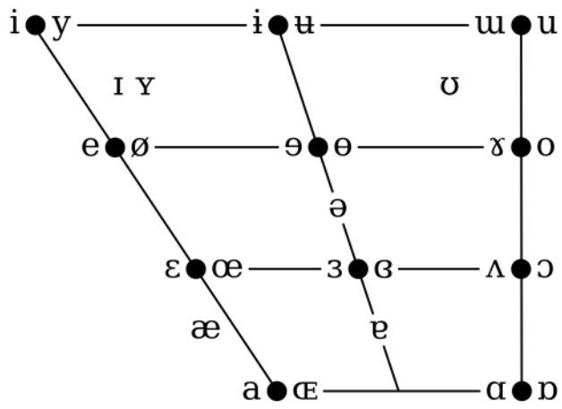
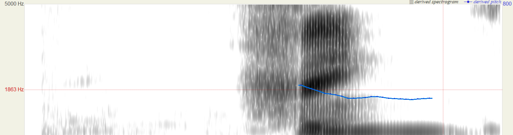

> This is a series of blogs about linguistics. See also: [_Morphology and Semantics_](../Morphology-and-Semantics/), [_Writing Systems_](../Writing-Systems/), [_Phonetics and Phonology Part 2_](../Phonetics-and-Phonology-Part2/) 

# How Sounds Work
At first, the question of "how do sounds work" may seem dumb - you just vibrate your vocal cords, right? However, it's more complicated than that. When you were a baby, you were as educated as a linguistics major in that you were able to identify how different sounds are made from observing people's mouths. Now, it's more difficult to do so, and you may struggle - unless, of course, you're a baby reading this, and in that case, you should become incredibly famous and win a world record if you haven't already. 

In kindergarten, you may have learned that sounds are classified as vowels and consonants, and that sounds are known as phones. 

But what really is the difference between a vowel and a consonant? It's basically just how much constriction your vocal cords have - vowels have entirely unobstructed airflow, while consonants have noticeable obstruction in the airflow. 

## Consonants 

Right now, let's do consonants. In short, the two main parameters that control how a consonant is made are "place of articulation" and "manner of articulation".

### Place of Articulation
Place of articulation is essentially where in your mouth a sound is being made, whether it is deep in the throat (I'm looking at you, certain language primarily spoken in a country that borders Belgium, Germany, Luxembourg, Spain, Andorra, Monaco, Brazil, Suriname, and Italy) or front in the lips (like at the end of "dumb"). From deepest in the throat to closest in the lips, the most commonly referred to categories include glottal, pharyngeal, uvular, velar, retroflex, palatal, alveolar, dental, labiodental, and bilabial.

{.lightbox}

The original diagram is from [here](https://learnteachtravel.com/consonant-sounds-4-place-of-articulation/).

### Manner of Articulation

Manner of articulation is how the sound is actually made. For example, there is a difference between "boron" and "moron", even though both [b] and [m] are both "bilabial" sounds (one of the places of articulation mentioned above). 
Such manners of articulation include:

* Fricatives (blowing air, like in the "sssss" sound in "snake")

* Plosives (stopping the sound, like how in "dart", pronouncing both the [d] and [t] can't really be continued)

* Nasals (where air comes out of your "nnnnn-nostrils"). As an experiment, try to block your nostrils by pressing one finger on either side of your nose really hard, and then go "nnnnn" or "mmmmm" or "ŋŋŋŋŋ" (the last one is velar, like the "n" in "bank"). You'll likely feel the air coming from your lungs but then being trapped because it can't escape through the nose, so it might try to go through your ears instead, and you'll feel a lot of pressure there, similar to when your ear pops on an airplane. Or maybe a much less painful demonstration would be if you put your finger right in front of your nostrils, and pronounce two voiced, continuous consonants at the same place of articulation, where one is a nasal and one is a fricative, such as [n] and [z]. You'll feel the air going on your finger in the first case, but not the second. 

* Affricates (starts as a stop, ends as a plosive). Technically, two sounds are being produced, which is why playing the audio backwards won't sound identical, but many languages, like English, treat them as a single sound, while the backwards version is two different sounds. Think of the English word "chop". If you ask a native speaker to say this backwards, they might say "potsh", because they think of the "ch" (voiceless postalveolar affricate) as a single sound. However, the real audio played backwards will sound more like "posht", because the two sounds in this affricate should also get reversed. 

* Trills (where a sound is like a plosive but gets rolled, like the Spanish rolled r in "perro") 

* Taps (like trills but only touches once, not multiple times)

* Semivowels (consonants that are like vowels because they have very low constriction). For example, [j], [ɹ], and [w] sound a lot like [i], [ɚ], and [u], respectively. 

* Laterals ("l"-like sounds basically where airflow goes through either side of the tongue). This includes lateral fricatives like the Welsh "ll", as well as the two .   

* Clicks (air is sucked in instead of pushed out because the velum is closed off, but unfortunately these cool sounds don't exist in English, so I can't provide an example you know how to pronounce. However, the name of the language Xhosa, (in)famous for having a lot of clicks, has a click in its name when not butchered as /kshosa/);

* Implosives (like clicks except the glottis is closed off instead)

* Ejectives (a stop is held shut, so the air is forced to come out from the glottis instead of the lungs)

and more. 

#### Pulmonic and Non-Pulmonic Consonants

Clicks, ejectives, and implosives are different from the others. Instead of using air from the lungs, they use different sources. These are called *non-pulmonic consonants*, while consonants that use air from the lungs are called *pulmonic consonants*

### Voicedness

Another important parameter is voicedness. Voicedness is just if the vocal cords are vibrating while the sound is being made. To understand this, look at [s] and [z], or [k] and [g] (as an exercise, find the voiceless version of [b]). In most languages, this has a really important distinction. For example, take "tie" and "die". However, we usually just include this within manner of articulation, because we can't put 3D charts on the iPad screen your face is glued to. 

### Other Parameters

Consonants are classified in other ways than just the main two or three parameters, though. 
For example, there are pulmonic and non-pulmonic consonants. This just means if the sound is normal or a freak that doesn't use air coming from the lungs. The only non-pulmonic consonants are implosives, ejectives, and clicks, and the rest are generally pulmonic. 

Another classification is continuancy. Fricatives, nasals, approximants, and trills can be pronounced for a long time, so they are continuant, but stops, affricates, and clicks are pronounced instantly. I noticed this specific feature at a young age, before I knew any linguistics, so I find it extra cool.

Additionally, there are more factors that can alter a consonant. 

If you know Hindi, for example, you know how aspiration - putting extra air after a consonant - can impact a word and does matter, like in the words "पल" (pronounced like "pal", meaning "moment") and "फल" (pronounced like "phal", meaning "fruit"). 

In Russian, palatalization - making the consonant more like a palatal sound, which basically just makes it sound like "y" sound is at the end - is a very important factor too, with the words "мать" (pronounced like "maty" with the y being the sound in "yo" and not "corny") meaning "mother" but "мат" (pronounced like "mat") meaning a swear word. 

Gemination - making a consonant pronounced for longer - is important in Finnish, because "tapa" means "way" or "manner", but "tappa" means "kill". 

Unreleased stops are when you're about to pronounce a stop but don't actually produce that sound. For example, in American English, the word "bot" might end with your tongue on the alveolar ridge, but you won't actually hear the [t] sound. These aren't distinguished in English65

### Sonorants and Obstruents

There is also sonorance or obstruence. Sonorance means the vocal tract is pretty open, like a vowel. As a result, most sonorants, which include nasals, approximants, and liquids, tend to be voiced. Obstruence means there is some friction or turbulence which make the sounds more easily voiceless and are noisier. Obstruents include plosives, fricatives, and affricates. Sonorants include nasals, liquids, and approximants.

This isn't a clear binary, but rather a hierarchy, arranged by the degree of constricion.

## Vowels
Even in vowels, two main parameters affect how a vowel is made. While vowels are not that interesting in my opinion, they are definitely required, because without them you'd be speaking either gibberish or Polish. Vowels tend to be voiced because they are sonorant and made by vibrating the vocal cords. 

::: {.callout-note}
## Cool fact to bore your friends with and be called a nerd!!!
The reason why whispering is quiet is because what you're really doing is not vibrating your vocal cords at all. Since vowels are inherently voiced, by whispering, you end up not being able to project your voice very much at all, as vowels are kind of the base of speech.
:::

The parameters are backness (deep in the throat or front in the mouth, like the x-axis) and height (vertical position, but described using open or close, like the y-axis). 
A third binary parameter is there, roundedness, which is if your mouth is shaped like a circle or not. 

For example, the [i] sound is a closed front unrounded tense vowel.

Unlike consonants, backness and height are continuous and based on physical space, and when you chart the different vowels according to these features, you get essentially a diagram of your mouth (which is why it is shaped like a trapezoid, not a rectangle like the consonants - the cross-section of our faces is shaped approximately like this). This is called a [_vowel diagram_](https://en.wikipedia.org/wiki/Vowel_diagram).

{.lightbox}

There are many more variations to vowels that can be made now, and this can influence phonology too (as you'll see in the next part). 

For example, tone is a big factor in Mandarin. 糖 (táng) means sugar, but 汤 (tāng) means soup. Imagine going to a cafe and accidentally asking for soup in your tea instead of sugar... 

Nasality (how much air comes out of the nostrils) is important in Fr\*nch, as "a" means "has" but "an" means "year". 

Rhoticity (how much the vowel sounds r-colored) makes the word "or" sound American when rhotic, but British when you only pronounce it like /oː/. 

Vowels can also have creaky or breathy voice (basically making it sound like a sheep or a zombie). 

Vowel length, like gemination but for vowels, is distinguished in Thai.

However, if you mess up some distinctions while trying to speak a language, its native speakers will most likely still understand you based on context, although they would likely notice that it sounds off. 

# Spectrograms

Basically, this is just a graph that records a word being pronounced, where the y axis is frequency and the x axis is time, and both are independent of each other (at a given time, your vocal cords produce a combination of frequencies, which are separated using Fourier analysis). We also want to encode energy as a function of these two, but instead of drawing a z axis, it's indicated through shading instead. Darker shading means more acoustic energy (or loudness), and lighter shading means less.

Bands of shading are called *formants*, and they're mainly for vowels. They are basically the three parameters that vowels take - F1 is high/low, F2 is front/back, and F3 is rounded/unrounded.

Here is the spectrogram for the word "things":

{.lightbox}.

Note that the blank space in the first half isn't part of the word itself - there was a gap between starting the recording and saying the word. 

This blue line measures how fast the vocal cords are vibrating. After the "th", everything is voiced, which is why it only starts after that first part. 

# To Be Continued

Now that you know how sounds are produced, let's find out how linguists [write them](vaishnavs.net/posts/).