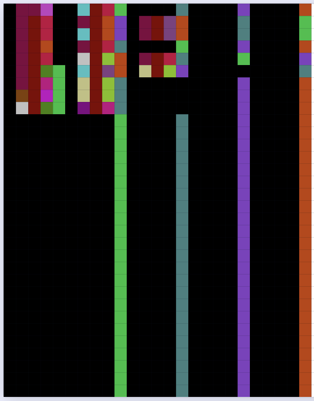

# Introduction

A picture is worth a thousand words, as you might have heard. But what if a picture is QUITE LITERALLY a thousand words??? That's where Pikbasa comes in. 

By the way, if you didn't know, "basa" is one of the forms of the borrowing of the Sanskrit word "भाषा" (/bʱaʂa/), meaning "language", into many different Southeast Asian languages. I just didn't want to call my language "Piklang" because that sounds too boring. 

# Basic setup

We have a matrix of pixels with 40 rows and 25 columns. Each pixel has a certain color and represents a unit of meaning (a thousand words would mean each pixel is a word, or Pikbasa is an isolating language; however, if you analyze each pixel as a morpheme, then we have a polysynthetic language where a picture is forty words - so let's not do that). 

# Color "Phonemes"

A pixel's color can be represented with its RGB values. Each component, from $0$ to $255$, has four intervals - $0: [0, 63]$, $1: [64, 127]$, $2: [128, 191]$, and $3: [192, 255]$. Three components makes $4^3=64$ possible colors, which I guess are the phonemes, but all words are one morpheme, and all morphemes are one phoneme, so each phoneme is also a word. Any two colors where each component is in the same interval will not be distinguished, and will be considered the same phoneme - for example, $(R,G,B) = (0,0,0)$ is the same phoneme as $(R,G,B) = (32,32,32)$. 

We can refer to a phoneme with its interval for each color component. For example, $/023/$ means the red is between $0$ and $63$, the green is between $128$ and $191$, and the blue is between $192$ and $255$. The order of the phonemes is the same order within the list of the same name here: 

<pre><code>phonemes = []
for R in range(4):
    for G in range(4):
        for B in range(4):
            color = (R, G, B)
            phonemes.append(color)
</code></pre>

By the way, now's a good time to come clean. Pikbasa is technically not a language. One of the characteristics of a language is that it is productive - a finite amount of building blocks can make infinite sentences. On the other hand, a Pikbasa sentence has $25$ words (more details on that in the next section), each with at most $64$ possible distinguished colors. While $64^{25}$ as an upper bound is huge, it's not infinite, making Pikbasa not productive. I assume, however, that most of you reading this are not annoying "erm actually" people, so Pikbasa is a language for the purposes of this showcase. 

If you don't know about phonemes, you might want to read my blog post on [phonology](https://vaishnavs.net/posts/Phonology/). 

# Within a row

Each row of $25$ pixels encodes a sentence. There are five chunks of five pixels. The first five indicate the subject, the next five the object, the next five the locative/allative, the next five the ablative, and the final five the verb. Each of these has the same format.

$[\text{Color}][\text{Size}][\text{Goodness}][\text{Root}][\text{Syntactic Role}]$.

Let me clarify these first three a little.

Color is, well, the literal color, for nouns (but only if there is a single color one wants to specify, and for abstract concepts, it's what color the symbol for it is written in). The color is encoded by a pixel of the same color. For verbs, it means something totally different - the *speed* at which the action was done. Slower means earlier phonemes, while faster means later phonemes. 

Size can mean the literal physical volume, quantity, or mass or however you want to define "size" of an object. For verbs, it means how much (or hard) an action was done. Lower size means earlier phonemes, while higher size means later phonemes. Also, if you use it as quantity, then each phoneme's index corresponds to that exact quantity, except for $/333/$, which means at least $63$. 

Goodness for both nouns and verbs is how good or bad the speaker views that noun or verb to be. And you guessed it! Worse means earlier phonemes, while better means later phonemes. 

Note that these adjectives/adverbs (except for color of a noun) are based on a scale from $1$ to $63$, according to the indices of the list of phonemes. Null is $0$. Neutral is $32$. 

There are $64$ semantic roots for nouns and verbs. I will put a dictionary at the end for that. 

Syntactic role is just the last pixel of the chunk, telling you whether it's the subject, object, locative, ablative, or verb. 

Since there is case marking, the word order is free. Any permutation of these five chunks is acceptable and equally grammatical. However, the order of words within a chunk is fixed. 

# Nulls, Split Ergativity, and Copula

What if some of the noun phrases or verbs aren't present? In this case, we use the null symbol $/000/$, to indicate the lack of a root and its adjectives. We still keep the syntactic role symbol. We also use the null symbol if some adjectives don't apply or aren't wanted to be specified. 

If the verb is a copula, that is the only time it will be null. So, "A is B" would be more like "A (subj) B (obj)", no verb. "A exists" would be "A (subj)" with everything else null. "A is in B" would be "A (subj) B (loc)" with everything else null. I think you get the idea. 

What about intransitives? Either the subject or the object will be null. If the sentence's row $\bmod 10$ is at most $4$, then the alignment is nominative-accusative, meaning the object is null and the verb's argument is the subject. Otherwise, the alignment is ergative-absolutive, so the subjet is null and the object is the verb's argument. Split ergativity, yay!!! Note that rows are zero-indexed, so the first row is row $0$. (By the way, you can learn more about split ergativity on my blog post on [morphosyntax](http://vaishnavs.net/posts/Morphosyntax/)!)

# Multiple sentences

The structure of a single sentence doesn't allow you to say much. For example, recursion is nonexistent since sentences have only terminal phrases. So, how would you say "The cat the dog the human owned chased sneezed"? You'd just phrase it as "The human owned the dog. The dog chased the cat. The cat sneezed", which is allowable from the template. Yeah, I know center embedding is just grammatical sentences larping as ungrammatical ones (you wouldn't expect "owned chased sneezed" to occur), but it's one of the simplest instances of recursion in English. 

Possession is indicated through ablative, and recursive possession can be done in a similar way. Note that "A owns B" is expressed as "B from A". 

Apart from these clarifications, use your creativity to use many sentences (remember, at most $40$) to express stuff. 

If you write less than forty sentences, then the rest of the rows are fully null. 

# Example translation

Let's translate the quadratic formula song (if you don't know, it's supposed to be sung to the tune of "Pop Goes the Weasel"). 

The original is this: "x is equal to negative b, plus or minus the square root, of b squared minus four a c, all over two a". 

We can first format it like this:

* mystery (subj) is minus variable 1 (obj)

* variable 1 (subj) change (verb) from 1 function 1 (abl)

* variable 1 (subj) change (verb) from -1 function 1 (abl)

* function 1 (subj) to variable 1 (loc)

* variable 1 (subj) 63 combine in variable 1 (loc)

(switch to ergativity)

* self (obj) minus change (verb) from 62 combine (abl)

* variable 2 (obj) in 62 combine (loc)

* 4 variable 3 (obj) in 62 combine (loc)

* 63 self (obj) in 2 variable 2 (loc)

Umm, yeah. That is very sus. I made each unique instance of "combine" have its magnitude decrement to distingush them. Pikabasa is like Toki Pona in that you must be very creative to even express anything, while it's hard to decipher what something says. 

Here's what it looks like:

{.lightbox}

# Spoken form

Did you know that the Spanish spoken in the Canary Islands has a whistled variant? It's the exact same language, but all the phonemes are encoded as whistles of different frequencies. Another example of encoding a language in a different form might be Morse Code, where English letters are represented as dots and dashes. So, I thought it might be cool if Pikbasa could also have a system of encoding - except this time, there's a bijection between pixel "phonemes" and oral (consonantal) *phonemes*. 

So recall that each pixel is $/RGB/$, where $R, G, B \in \{0, 1, 2, 3\}$, and encode the amount of each red, green, and blue component respectively (with intervals so we have $4^3$ and not $256^3$ phonemes). Here's how we can make this spoken.

R: 

|Number|Place of articulation|
|------|---------------------|
|$0$   |Bilabial             |
|$1$   |Alveolar             |
|$2$   |Velar                |
|$3$   |Uvular               |

G:

|Number|Manner of articulation|
|------|----------------------|
|$0$   |Stop                  |
|$1$   |Fricative             |
|$2$   |Trill                 |
|$3$   |Click                 |

B: 

|Number|Binary modifications |
|------|---------------------|
|$0$   |Voiceless unaspirated|
|$1$   |Voiced unaspirated   |
|$2$   |Voiceless aspirated  |
|$3$   |Voiced aspirated     |

Pikabasa is already so weird that we need a little bit of boringness, so we just pronounce the picture left to right, top to bottom. 

# Dictionary

While the words for adjectives/adverbs are just a ranking of how true that semantic dimension is on a scale from $0$ to $63$, nouns have to be mapped manually. Also, let me quickly tell you the syntactic role particles: $(\text{Subject}, \text{Object}, \text{Locative}, \text{Ablative}, \text{Verb}) = (0, 13, 26, 39, 52)$ - so every multiple of 13 is a syntactic particle. 

Anyway, back to the noun or verb roots. They are presented as nouns, but they can and will be used as verbs too - use your creativity for that part, as it may not be obvious. 

|Pikbasa |English |
|--------|--------|
| $0$    |Null    |
| $1$    |Prokaryote|
| $2$    |Eukaryote|
| $3$    |Polar substance| 
| $4$    |Nonpolar substance|
| $5$    |Nation  |
| $6$    |Boundary|
| $7$    |Movement|
| $8$    |Pattern |
| $9$    |Time    |
| $10$   |Nearby place|
| $11$   |Far-away place|
| $12$   |Process |
| $13$   |Meeting |
| $14$   |Realm   |
| $15$   |Language|
| $16$   |Idea    |
| $17$   |Event   |
| $18$   |Choice  |
| $19$   |Thought |
| $20$   |Destruction|
| $21$   |Desire  |  
| $22$   |Question|
| $23$   |Tool    |  
| $24$   |Self    |
| $25$   |Audience|  
| $26$   |Origin  |  
| $27$   |Set     |  
| $28$   |Condition|
| $29$   |Information|
| $30$   |Lie     |    
| $31$   |Picture |    
| $32$   |Justice |    
| $33$   |Money   |    
| $34$   |Sight   |    
| $35$   |Answer  |    
| $36$   |Attempt |    
| $37$   |Search  |    
| $38$   |Change  |    
| $39$   |Science |    
| $40$   |Game    |    
| $41$   |Segment |    
| $42$   |Entertainment|
| $43$   |Evidence|    
| $44$   |Combination|    
| $45$   |Translation|
| $46$   |Rule    |
| $47$   |Recursion|
| $48$   |Conflict|
| $49$   |Variable 1|
| $50$   |Variable 2|
| $51$   |Variable 3|
| $52$   |Function 1|
| $53$   |Function 2|
| $54$   |Function 3|
| $55$   |Mystery |
| $56$   |Encryption|
| $57$   |Description|
| $58$   |Interaction|
| $59$   |Necessity|
| $60$   |Hierarchy|
| $61$   |Growth  |
| $62$   |Skill   |
| $63$   |Other   |

# Further information

* More information on the whistled form of Spanish in this National Museum of Language [article](https://languagemuseum.org/language-of-the-month-august-2023-silbo-gomero/).

* You can listen to the quadratic formula song [here](https://www.youtube.com/watch?v=VOXYMRcWbF8).

* The four-way voice/aspiration distinction for the whistled form of the blue component was inspired by the same distinction in [Sanskrit](https://en.wikipedia.org/wiki/Sanskrit#Consonants).

* Here are the [origins](https://en.wikipedia.org/wiki/A_picture_is_worth_a_thousand_words#History) of the proverb "a picture is worth a thousand words".