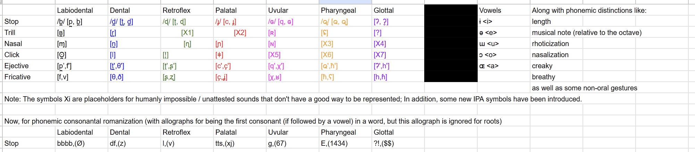

# Introduction

I made a conlang out of a friend's Discord username. If you know you know. Otherwise don't ask. Hopefully, this language is better than [Limit](https://vaishnavs.net/posts/Limit%20riLmOtOpU/), because I recently finished reading David J. Peterson's book *The Art of Language Invention*. 

A lot of features that *should* exist aren't yet present. This is because Proto-Zorbbbb, is, well, a proto-language. Just wait for my blog post on Zorbbbb to see that evolution emerge. 

# Lore

Zorbbbb is a planet from an unknown solar system and galaxy, and it's what the country, and in turn the language, is named after. 

Proto-Zorbbbb is what evolved later into Zorbbbb, and strongly influenced West Jikur Sign Language, and Limit. Some Limitian linguists believe that Proto-Zorbbbb may be the ancestor of Limit and WJSL, but it's hard to prove. Zorbbbb is nowadays a dead language since Zorbbbbistan no longer exists, but many Proto-Zorbbbb resources are found in the corners of Limitland, in ancient Zorbbbbistani buildings. That's good, because otherwise it would have been impossible to reconstruct it using Zorbbbb, which is completely different, and Limit and WJSL, which might not even be related to it. 

West Jikur is a city in rural Limitland inhabited by aliens who *can* process frequencies, just from mechanical oscillations rather than sound waves. More on that entire language in a future blog post. 

Zorbbbbistan and Limitland are countries that overlap in space (since Zorbbbbistan is from the past), and each has land that the other doesn't have too. 

The Proto-Zorbbbbistanis invented their own orthography. Later, with the arrival of English to the planet Zorbbbb, they made their own romanization to teach newcomers their language, but the letter choices might seem nonsensical, since the Proto-Zorbbbbistanis didn't formally learn the alphabet. There is a second romanization that is only used for typing (the default graph's first letter). 

<details>
<summary>Slight tangent</summary>

Ok, you know how fiction entertainment industries hire conlangers to make a language for their story using a few clues about the language throughout? I think I need to do the reverse - hire a fiction writer to write a book about the speakers of my language given the few clues about the lore. I'm not a fiction writer, I only conlang because it's basically just math at the end of the day. 

Fun fact: Tolkien wrote Lord of the Rings to house his conlangs like Sindarin and Quenya, so he also went the backwards route. 

</details>

# Sounds and Writing

## Sound Inventory

Let's start with the sound inventory. 

{.lightbox}

Note that there are a bunch of seemingly unproducable sounds here. For example, the glottal nasal. If there is a closure at the glottis, how can air escape through the nasal cavities? It's simple - Proto-Zorbbbistanis were able to manipulate 4D space, allowing air to extend beyond 3D barriers and come back. This phenomenon is kind of like if you live on the real number line and there is a barrier at x=0 and you want to cross from the negatives to the positives, you can jump into the complex plane to go around it. 

## Allophony

Note that this will look a LOT like pseudocode. 

The default form of each phoneme is a voiced stop. Only the manner of articulation may change, but the place of articulation remains constant. 

If it is at the beginning of a word,

* If it is followed by a rounded monothong, it becomes a voiced fricative.

* Otherwise if it is followed by an unrounded monothong, it becomes a voiceless fricative.

* Otherwise if it is followed by a dipthong, it becomes a click.

* Otherwise if the next consonant is voiceless, it too becomes a voiceless stop. 

Otherwise if it is in the middle of a word and has vowels on either side,

* If it is preceeded by a nasal vowel, it becomes a voiced nasal. 

* Otherwise if the vowels have the same roundedness, it becomes a voiceless ejective stop.

* Otherwise if they don't have the same roundedness, it becomes a voiceless ejective fricative. 

Otherwise if it is at the very end of a word (with no vowel following it), it becomes a voiced trill. 

Otherwise, it remains as a voiced stop. 

## Phonotactics

Pretty much the only rules are that there may be at most two vowels between consonants, and a word may not start with a vowel. In theory, a tense auxiliary or a holy being could have any number of adjacent consonants, but since they don't, 5 is the maximum number of consonants you can have in a row. 

A syllable is just a vowel and, before that, how many ever consonants precede it before you reach another vowel or the start of the word. Or, in the case of a tense auxiliary or a holy being, that entire word will be a single syllable. 

## Prosody

Since each syllable has a specified musical note and length (as you will see soon), stress really doesn't exist from these factors. However, the only hope for having prosody is loudness and octave, which are not phonemic. These are both relative binary features - as in, anything that's not the highest possible octave can be considered "low", and so on. 

The first syllable is loud if it has up to three consonants. Otherwise, it's the final. If there's only one syllable with at least four consonants, then I guess these two cases are the same thing. 

Octave is the other way around. The last syllable has a high octave if it has up to three consonants, otherwise it's the first. 

Yeah, don't listen to Proto-Zorbbbbistani poetry. 

## Orthography

The romanizations of the root consonants are given in the sound inventory chart. 

Since the main meaning of a word comes from the consonantal roots, these are the only symbols with mandatory glyphs, just like Arabic. Therefore, the orthography is an abjad. 

Sentences are written from left to right for 8 characters, then right to left on the next line below (but the orientation of each character doesn't change) for another 8 characters, and so on. 

There are characters for bbbb, df, l, E, ?!, g, tts, word boundaries, and sentence boundaries. Note that there are no commas. There are also allographs for the consonant characters. However, while the romanization only uses the allographs when the first consonant is followed by a vowel, the native orthography uses allographs for the first consonants of all words. 

The orthography is also cursive. The Proto-Zorbbbbistanis used to trace writing in the air before paper came along. They could only manipulate the 4th dimension in their mouths, not outside, so they couldn't teleport their hands. As a result, the writing was analyzed as cursive. 

Note that the allograph in the second romanization is switching the case of the first letter, except for ?!, where ? turns to !. Also, 0 refers to word bounaries (spaces) and 1 refers to sentence boundaries (periods). 

See the font [here](orthography.png). 

<details>
<summary>Fontmaking</summary>

I used the website [https://www.textstudio.com/font-maker](https://www.textstudio.com/font-maker) to map each character to a glyph. 

</details>

# Nouns

All nouns have genders, class, animacy, number, politeness, abstractness, color, case, goodness, and person. This means that, theoretically, there are $134217728$ combinations of each noun. Each will have a sequence of something.

Now, let’s go into the specific categories for each one.

Location: Vowel

Animacy: Musical note

Class: Semivowel (right after consonant)

Number: Vowel length

Politeness: Liquid (right after semivowel - or consonant, if the semivowel doesn't exist)

Abstractness: Speech manner

Color: Altered vowel

Case: Exercise

Goodness: Gesture

Person: Second Vowel

## Location

| Location                              |  Vowel  |
|---------------------------------------|---------|
|Inside Zorbbbbistan, inside Limitland  |o a Ø u e|
|Inside Zorbbbbistan, outside Limitland |a Ø i o Ø|
|Outside Zorbbbbistan, inside Limitland |u Ø i a Ø|
|Outside Zorbbbbistan, outside Limitland|e e o i a|

## Animacy

All in the same octave starting at one C and ending strictly before the C higher than that. 

| Animacy              | Note       |
|----------------------|------------|
|Unbelievably nonliving|C F# F B G# |
|Very nonliving        |E G G# B A  |
|Pretty nonliving      |C C# D D# E |
|Kinda nonliving       |D D# C# E F |
|Kinda living          |C# D C# C C#|
|Pretty living         |F# D D F# B |
|Very living           |C E E B F#  |
|Unbelievably living   |F# F F# G A#|

## Class

(N = none, Y = /j/, W = /w/)

|Class      |Semivowel|
|-----------|---------|
| Vehicle   | Y Y Y   |
| Power     | N Y Y   |
| Labor     | N N N   |
| Nature    | N N W   |
|Destruction| W Y W   |
|Information| W W N   |
| Food      | Y N Y   |
| Other     | Y W N   |

## Number 

(S = Short; N = Normal; L = Long)

| Number          |Length |
|-----------------|-------|
| 1D Continuous   | S S S |
| 2D Continuous   | N S S |
|4D Continuous    | L S L |
|Beyond Continuous| S N L |
|1D Discrete      | N L N |
| 2D Discrete     | L L N |
| 4D Discrete     | S N S |
| Beyond Discrete | N N N |

Lemme explain what this means. Discrete means the number of possible quantities for this noun is $\aleph_0$, and continuous means the number of possible quantities for this noun is $2^{\aleph_0}$. 

1D means the number belongs on the real number line, 2D for complex, 4D for quaternions, and beyond for 

## Politeness 

(X = [l], R = [ɹ])

|Level             |Liquid |
|------------------|-------|
|Unbelievably trash| R R R |
|Very trash        | N R R |
|Pretty trash      | X R X |
|Kinda trash       | N N X |
|Kinda god         | R X N |
|Pretty god        | X X N |
|Very god          | R N R |
|Unbelievably god  | N N N |

## Abstractness 

(C = Creaky; N = Normal; B = Breathy)

| Abstractness        |Manner |
|---------------------|-------|
|Unbelievably abstract| C C C |
|Very abstract        | N C C |
|Pretty abstract      | B C B |
|Kinda abstract       | N B N |
|Kinda concrete       | C B N |
|Pretty concrete      | B B N |
|Very concrete        | C N C |
|Unbelievably concrete| N N N |

## Color 

(NS = Nasal; N = Normal; R = R-Colored)

We take the three color components needed to form all colors: Red, Green and Blue.

For any component X, !X means its value is between 0 and 127, and X means its value is from 128 to 255.

|Color   | Alteration   |
|--------|--------------|
|R G B   |NS NS NS NS NS|
|!R G !B | N NS NS R R  |
|R G !B  | NS N N N R   |
|R !G !B | N N R R R    |
|R !G B  | NS R N NS R  |
|!R !G B | R R N N NS   |
|!R G B  |N R NS R N    |
|!R !G !B| N N N N N    |

## Case 

(L = Left Foot; R = Right Foot; B = Both Feet; G = Lie Down on the Ground; C = Criss-Cross Apple Sauce, W = Lean against Wall)

|Case        | Position  |
|------------|-----------|
|Ergative    | B B B B B |
|Absolutive  | C R B G L |
|Genitive    | R G C C L |
|Locative    | B C L L R |
|Ablative    | R L R G G |
|Allative    | B C G G C |
|Instrumental| L L B C G |
|Vocative    | G G R C C |

## Goodness 

(N = Normal; F = Flap hands downwards violently; S = Six Seven)

| Goodness |Gesture|
|----------|-------|
|Super good| N N N |
|Good      | F N N |
|Bad       | S N S |
|Super bad | F F S |

## Person 

* The second vowel gets no vowel alteration - only the first may do so

* If the second vowel is the exact same as the first, it's gemination instead of a dipthong

| Person| Vowels  |
|-------|---------|
|First  |Ø Ø Ø Ø Ø|
|Second |Ø i i i i|
|Third  |a Ø Ø Ø u|
|General|u o e a o|

Second person is only for someone actively in a conversation, so the audience of a speech is third person or general. General means not just people outside the conversation but literally any subset of people, equivalent to "one" or "people". 

## Romanization of nouns

Apart from what exists in the sound inventory chart for vowels, there's also a romanization for features between the root consonants. 

Breathy voice - add ⟨h⟩ to the vowel

Creaky voice - add ⟨!⟩ to the vowel

Nasal vowel - if the vowel is phonetically rounded, add ⟨n⟩, otherwise ⟨m⟩

Rhotic vowel - if the vowel is phonetically rounded, add ⟨y⟩, otherwise ⟨r⟩

Second vowel - write it after the first vowel, same glyphs

Semivowels - write ⟨y⟩ or ⟨w⟩ right after the consonant

Short vowel - write ⟨%⟩ after the vowel

Long vowel - write ⟨^⟩ after the vowel

## Examples

A bar represents that the pattern has restarted. If the number of consonants is at most the period of that pattern, there won't be a bar. 

emagehttsoli:

* root: bbbb g tts l (4 consonants, approximately meaning "creature")
* vowels: e e o i -> outside Zorbbbbistan and Limitland
* alterations: NS N N N -> R G !B (intended yellow)
* manners: N B N | N -> kinda abstract
* liquids: N N N | N -> unbelievably god
* semivowels: N N N -> labor
* second vowels: a Ø Ø Ø -> third person
* lenghths: N N N | N -> beyond discrete (intended octonion)

The rest isn't recorded in the romanization, but there is also stuff like gestures and orientations that reveal "super bad", "very living", and the ergative case. 

In other words, it means "minion"! (specifically when it's doing something to something else)

Yes, the Proto-Zorbbbbistanis believed that minions must be counted with 8D numbers. Don't ask. 

zorbbbb: 

* root: df bbbb (2 consonants, approximately meaning "land")
* vowels: o Ø -> inside Zorbbbbistan and Limitland (since the second vowel is null, the second feature for all other components is unknown)
* alterations: R ? -> !R !G B (intended blue)
* manners: N ? -> unbelievably concrete (this is what is intended, but it's ambiguous without context since other levels of abstractness start with N too)
* liquids: N ? -> kinda trash (also ambiguous)
* semivowels: N ? -> nature (guess what? ambiguous!)
* second vowels: Ø Ø -> first person 
* lengths: N ? -> 1D discrete (yet again, ambiguous, but hey, at least you don't need 8 different dimensions to count "zorbbbb"s now)

There are other unrecorded features too - "super good", "unbelievably nonliving", and the locative case (most likely, since you'll probably see "I am in Zorbbbb" more often than, say, "Zorbbbb ate me").

The planet Zorbbbb is what this means. You may be wondering how a planet can be inside two of its countries. It's because the name for the planet came later, once Proto-Zorbbbbistani astronomy became more sophisticated. At first, it only referred to the capital of both Zorbbbbistan and Limitland. 

## Some notes about nouns

There are also case *endings*, along with the body positions coming with it, making these orientations optional but still highly recommended in formal speech. Note that these are the same ending as speed for verbs, but this is due to some etymological quirk - they also converged before "no speed" energed.  

| Case       |Position   |
|------------|-----------|
|Ergative    | - E tts   |
|Absolutive  | - E g     |
|Genitive    | -  E ?!   |
|Locative    | -  ?! bbbb|
|Ablative    | -  ?! df  |
|Allative    | -  ?! l   |
|Instrumental| -  ?! tts |
|Vocative    | -  ?! g   |

Holy nouns that are superior to even the highest of the politeness level transcend declension. There is actually no declension, just a sequence of consonants. For example, the word for the Proto-Zorbbbb god, “df bbbb g”, is simply “df bbbb g”, no vowels, tones, vowel alterations, gestures, etc. 

Also, personal pronouns have special declensions too. The root for all pronouns is simply the root for the generic pronoun, which is "sgm". For every pattern for personal pronouns, the bottom most pattern is moved to the top, and the right most is moved to the left, pushing everything else down or right. For example, here’s what the example for case:

| Case       | Position  |
|------------|-----------|
|Ergative    | C G G R C |
|Absolutive  | B B B B B |
|Genitive    | L C R B G |
|Locative    | L R G C C |
|Ablative    | R B C L L |
|Allative    | G R L R G |
|Instrumental| C B C G G |
|Vocative    | G L L B C |

## Verb Form

There are 9 auxiliary verbs to account for the main 9 tense-aspect combinations. 

Verbs agree pattern-wise with the absolutive when they're negative, the ergative when they're positive, and the vocative when they're ambiguous about the affirmativement. If the ergative or vocative nouns don't exist for non-negative verbs, then use the next lowest verbal argument, with the hierarchy vocative -> absolutive -> ergative. But, they don't take on the specific pattern of the case itself, just all the other patterns from that noun. 

Verbs are conjugated in an agglutinative manner with respect to the following: 

Tense (Distant, Near, Now)

Aspect (Somewhat done, Almost done, Other)

Transitivity (Intransitive, Transitive, Ditransitive)

Affirmativement (Positive, Negative, Ambiguous)

Mood (Indicative, Imperative, Interrogative)

Emotion (Apprehensive, Admirative, Other)

Extremity (Weak, Normal, Extreme)

Effectiveness (No net effect, Some net effect, Huge net effect)

Evidentiality (First-hand No-cap, Second-hand No-cap, Greater No-cap, First-hand Some-cap, Second-hand Some-cap, Greater Some-cap, First-hand Full-cap, Second-hand Full-cap, Greater Full-cap)

Speed (Super Fast, Very Fast, Pretty Fast, Kinda Fast, Super Slow, Very Slow, Pretty Slow, Kinda Slow, No Speed)

Each possibility has a suffix added in this order.

There are $8916100448256​​$ possible forms of a single verb. 

### Tense

| Tense | Suffix   |
|-------|----------|
|Distant| - bbbb df|
|Near   | - bbbb l |
|Now    |- bbbb tts|

Obviously, since an unspecified "now" is an instant, and a verb must happen over an interval of time, "now" means the interval of 11.802 eye blinks between either side of that instant. 

### Aspect

| Aspect      | Suffix   |
|-------------|----------|
|Somewhat done| - bbbb g |
|Almost done  | - bbbb E |
|Other        | - bbbb ?!|

### Transitivity

|Transitivity| Suffix  |
|------------|---------|
|Intransitive|-df bbbb |
|Transitive  |- df l   |
|Ditransitive|- df tts |

Ditransitive means the verb also acts on the vocative - that is, the audience experiences in their mind whatever the verb is, so it's a second argument. 

### Affirmation

|Affirmation|Suffix|
|-----------|------|
|Positive   |-df g |
|Negative   |-df E |
|Ambiguous  |-df ?!|

### Mood

|    Mood     | Suffix  |
|-------------|---------|
|Indicative   | - l bbbb|
|Interrogative| - l df  |
|Imperative   | - l tts |

The interrogative mood is only for yes/no questions. Wh-questions just put the question pronoun in the same position as a normal subject or object. Interrogative is basically about willing something to happen, so not only second person. 

### Emotion

| Emotion    |Suffix |
|------------|-------|
|Admirative  | - l g |
|Apprehensive| - l E |
|Other       | - l ?!|

### Extremity

|Extremity|Suffix     |
|---------|-----------|
|Weak     | - tts bbbb|
|Normal   | - tts df  |
|Extreme  | - tts l   |

### Effectiveness

|Effectiveness  | Suffix  |
|---------------|---------|
|No net effect  | - tts g |
|Some net effect| - tts E |
|Huge net effect| - tts ?!|

### Evidentiality

| Evidentiality      | Suffix  |
|--------------------|---------|
|First-hand No-cap   | - g bbbb|
|Second-hand No-cap  | - g df  |
|Greater No-cap      | - g l   |
|First-hand Some-cap | - g tts |
|Second-hand Some-cap| - g E   |
|Greater Some-cap    | -  g ?! |
|First-hand Full-cap | - E bbbb|
|Second-hand Full-cap| - E df  |
|Greater Full-cap    | -  E l  |

### Speed

| Speed     | Suffix    |
|-----------|-----------|
|Super Fast |- E tts    |
|Very Fast  |-  E g     |
|Pretty Fast|- E ?!     |
|Kinda Fast |-  ?! bbbb |
|Super Slow |-  ?! df   |
|Very Slow  |- ?! l     |
|Pretty Slow|-   ?! tts |
|Kinda Slow |-   ?! g   |
|No Speed   |- ?! E     |

### Some notes about verbs

The nine auxiliaries are conjugated in a special way. They, just like the holy pronouns, have no conjugations, just the raw verb. They appear before the main verb. 

The auxiliaries are as follows: 

| Tense | Aspect    | Auxiliary (English) | Auxiliary (Proto-Zorbbbb) |
|-------|-----------|---------------------|---------------------------|
|Distant| Starting  |Consume              |   bbbb tts E ?! ?!        |
|Distant|Almost done|Observe              |   df df E                 |
|Distant| Other     |Flee                 |   l l g df                |
| Near  | Starting  |Energize             |   ?! bbbb g E ?!          |
| Near  |Almost done|Alter                |   tts l E g               |
| Near  | Other     |Destroy              |   bbbb E df               |
| Now   | Starting  |Invent               |   l g bbbb tts            |
| Now   |Almost done|Stop                 |   df tts ?!               |
| Now   | Other     |Break                |   g g g tts ?!            |

The meanings of the tense auxiliaries may not make much sense, but they basically obtained a second meaning through semantic drift. Maybe you can see how "flee", for example, might be related to the idea of a distant time, since it results in distant space. 

Tense also changes the vowel alteration of the verb. 

(NS = Nasal; N = Normal; R = R-Colored)

| Tense | Alteration |
|-------|------------|
|Past   |+NS         |
|Present|+N          |
|Future |+R          |

Whatever vowel alteration pattern the absolutive gets, the verb takes this and combines it with this addition. For example, if the patient is blue, it would be NS R N, but if the verb is past tense, then it turns into N R+NS NS. You can think of N as zero, and you can think of NS and R as switches. Combining NS and NS or R and R results in N, and combining N with something results in that thing. 

Also, verbs that mean "to be (emotion)" have their own special conjugations. Basically, the suffix is doubled. So, here's what transitivity for "to be (emotion)" would work:

Intransitive: - df bbbb df bbbb
Transitive: - df l df l
Ditransitive: - df tts df tts

# Number System

If you looked at the noun morphology, you'll realize that the only grammatical number is for the number of dimensions it has and whether it's discrete or continuous - not really for enumerating stuff.

There is an algorithm to encode any positive integer $n$ into words.

First, we list all the prime numbers in a row. Since $1$ is considered the $0^\text{th}$ prime number by Proto-Zorbbbbistani mathematicians, this is included in the beginning. 

* Take the largest prime number that is at most $n$, and mark it on that row. 

* Subtract this number from $n$.

* If the difference is $0$ or $1$, stop. 

* Otherwise, repeat this process on the difference. 

Now, in this list, we mark an unpresent prime with *bbbb* and a present prime with *tts*.

See the Python implementation below:

```python
def is_prime(n):
    if n % 2 == 0:
        return False
    # Check all the odd numbers up to sqrt(n) instead of all integers since it's twice as fast
    for i in range(3, int(n ** 0.5), 2):
        if n % i == 0:
            return False
    return True

def get_primes(n):
    primes = []
    while (n > 1):
        k = n
        while not is_prime(k):
            k -= 1
        primes.insert(0, k)
        n -= k
    if n == 1:
        primes.insert(0, 1)
    return primes

def make_root_word(n):
    used_primes = get_primes(n)
    total_primes = [1]
    for i in range(2, n+1):
        if is_prime(i):
            total_primes.append(i)
    primes = []
    for i in total_primes:
        if i in used_primes:
            primes.append(1)
        else:
            primes.append(0)
    root_word = ""
    for i in primes:
        if i == 0:
            root_word += "bbbb "
        else:
            root_word += "tts "
    return root_word
```

This algorithm is quite similar to how you'd encode a number in binary with a unique sum:

$n = \sum_{i=0}^{k} C_i X_i$, where $C_i \in \{0, 1\}$ and $k$ is the number such that $X_k \leq n$ but $X_{k+1} > n$. 

The only difference is that $X_i = 2^i$ for a binary system, but it's the $i^\text{th}$ prime number in the Proto-Zorbbbbistani system. 

How did this system originate? Humans use base 5, 10, or 20 to count using either their fingers on one hand, their fingers on both hands, or their fingers on both hands and their toes on both feet. Computers, fundamentally working in "on"s and "off"s, use base 2 or base 16. 

Proto-Zorbbbbistanis, however, were very greedy but in a weird way. At the annual national Zorbbbbistani meeting, there were $n$ candies to eat. The representatives of each territory had to take some of that candy and distribute it across their respective territory. 

There was national law (with a capital punishment for any violators) about how candies must be distributed with three parts: 

* A representative must distribute their candies evenly for anyone in the territory they govern who gets some (that is, any constituent can either not get a candy, or they get the same amount as everyone else who got a candy). 

* Someone must get at least two candies.

* The representative must be among the people who receive candy. 

A prime number would ensure that if the candies were distributed evenly, everyone who got a candy would either get a single one, or one person would get all of them. However, the first case violates the second part. The third part then guarantees that the representative is the one who gains all these candies. This loophole was never amended, and this corruption displayed by the Proto-Zorbbbbistani government is what led to their collapse.

So obviously, a prime number would be optimal. Now, which prime number? The biggest one that is at most $n$, of course, otherwise you're missing out on free candy! Then the next in line would have to take the largest remaining prime number and so on. 

After repeatedly taking the largest prime number every annual meeting, this eventually became the number system. 

# Syntax

The overall word order is VOS. Apart from the $VP \to V O$, everything else is head-final. 

## Recursion 

The particle *tts tts* means approximately "such that". In English, consider the sentence "The brown cat sees the big dog". The particle "such that" introduces a single precondition for the main sentence to be true, and it would be recursed that way. In Proto-Zorbbbb, the sentence above would be phrased like "Such that the cat is brown, such that the dog is big, the cat sees the dog". Note that each precondition has exactly one condition, and there can be infinitely many preconditions, since you can have the rule $S \to P S$, where $S$ is a sentence and $P$ is a precondition. 

This can be used for relative clauses, too. "I don't like the dog that bit me" would become "Such that the dog bit me, I don't like the dog". 

Another use of "that" is in "I think that you are dumb". This can also be phrased with "such that" - "Such that you are dumb, I think about you". The allative case is used for "about". 

The "such that" agrees with the absolutive of the sentence immediately following it.

Adpositional recursion is simple - just use the noun cases that exist. These always occur before the noun they modify. $N \to A N$, you can write, where $A$ is an adpositional phrase and $N$ is a noun (or noun phrase - they aren't separate categories like they are in English). 

# Logic

## Copula 

A copula is the thing mapping X to Y in "X is Y". However, there are two things that "is" can convey. Either $X = Y$, or $X \in Y$ (and if $X$ too is a set instead of a single object, then $X \subseteq Y$). 

Proto-Zorbbbb distinguishes $X = Y$ and $X \in Y$ with two different verbs. However, any noun is not distinguished from the set containing just that noun, so the same word is used for $X \in Y$ and $X \subseteq Y$. 

The root for "$=$" is "tts tts tts bbbb", and the root for "$\in$" is "l l E l df".

## Operators 

Conjunctions work the same way as they would for a programming language. If you have two statements (basically boolean values) $P$ and $Q$, then $P \wedge Q$ would be expressed with the root "l E df bbbb". Also, $P \lor Q$ would be expressed with the root "bbbb df E l" (yeah, it's just backwards). It would go between the two units. Finally, $P \oplus Q$ would be expressed with the root "l bbbb l bbbb df df E". 

There is a shorthand construction for conjunctions on lists. And no, there are no endless debates on Oxford commas. You just put the conjunction before all of the stuff if it is the same conjunction. Otherwise, you'd have to put a conjunction between each unit. 

For example, "I like dogs, cats, and monkeys" would be expressed as "and I like dogs I like cats I like monkeys", or "I like and dogs cats monkeys".  

Like the recursive "such that" particle, conjunctions agree with the absolutive of the sentence immediately following them too. 

## Quantifiers

The word for "all" is the same as the word for "and", the word for "exactly [n]" is the same as the word for "xor", and the word for "at least one" is the same as the word for "or". They are verbs though, not adjectives. 

"All dogs are stinky" would be something like "such that dogs [and] apply, dogs stink". Also, "[n] dogs are stinky" would be something like "such that n dogs [xor] apply, dogs stink". 

# Lexicon

Below are the roots for all the nouns and verbs. There are not that many (fewer than Toki Pona, actually), since quite literally millions of new words and meanings can be generated from a single root. 

*in progress*

## Nouns

| Noun           | Root           |
|----------------|----------------|
| Beast          |bbbb g tts l    |
| Land           |df bbbb         |
| Pride          |E E df ?!       |
| Burden         |?! g g bbbb     |


## Verbs

| Verb           | Root           |
|----------------|----------------|
|Equals          |tts tts tts bbbb|
|Subset          |l l E l df      |
|Lose            |l g g           |
|Walk            |df E df         |

# Examples

*in progress*

## The Universal Declaration of Human Rights, Article I

When you go on Wikipedia and look at its article on some language, it always gives a translation of the The Universal Declaration of Human Rights, Article I:

All human beings are born free and equal in dignity and rights. They are endowed with reason and conscience and should act towards one another in a spirit of brotherhood.

Let's do the first sentence. 

"Human beings" is derived from the root for "beast" - *bbbb g tts l*.

Proto-Zorbbbb doesn't allow for the passive construction. Instead, we shall denote the "born" part using "*dfbbbbg* invented". The "free and equal in dignity and rights" shall be expressed with "such that all beasts' dignity and rights are free and equal". The closest verb to "to be free" is "to walk", and the closest verb to "to be equal" is "to lose". "Dignity" and "pride" are not distinguished in Proto-Zorbbbb, and similarly for "burden" and "rights" (since having equal rights also means having equal limitations of rights).  

So, with the syntax of Proto-Zorbbbb, this sentence would become "such that all beasts' and dignity rights and are free are equal, dfbbbbg invented and beast". 

Let's write the raw consonants for now:

*tts-tts l-E-df-bbbb df-E-df-bbbb-tts-bbbb-g-df-bbbb-df-g-bbbb-bbbb-l-g-tts-l-tts-E-g-l-?!-bbbb l-g-g-bbbb-tts-bbbb-g-df-bbbb-df-g-bbbb-bbbb-l-g-tts-l-tts-E-g-l-?!-bbbb l-E-df-bbbb bbbb-g-tts-l-E-?! l-E-df-bbbb E-E-df-?!-E-g ?!-g-g-bbbb-E-g  l-g-bbbb-tts-bbbb-df-bbbb-?!-df-l-df-g-l-bbbb-l-g-tts-l-tts-?!-g-l-E-tts  l-E-df-bbbb bbbb-g-tts-l-E-g  df-bbbb-g-E-tts*

such-that and walk lose and beast-gen and pride-abs burden-abs invent and beast-abs god-erg

And these verbs have all those giant suffixes. Decode them yourelf (exercise for the reader, right)?

ALSO, I AM NOT GONNA FILL IN THE VOWELS OR WRITE THE PHONETIC IPA TRANSCRIPTION FOR THE SAKE OF MY OWN SANITY!!! 

Translating just that first sentence was so mentally exhausting, so I'm not doing the second. 

# Conclusion

Great conlang, right? The only problem is, this language is NOT staying stable. Stay tuned for it to evolve into Zorbbbb! 
