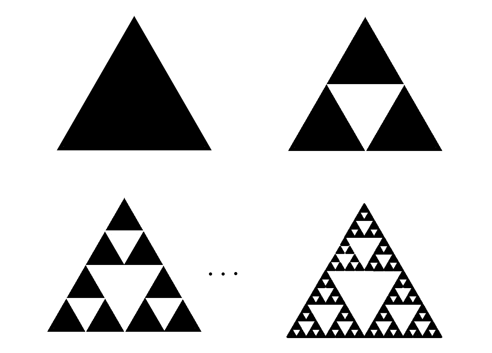

# Introduction

You may have learned about syntax in English class in school, and parts of what you likely learned are pretty close to linguistics, while others are horrendously off. 

Syntax is basically sentence structure. However, if someone says, "this sentence has short syntax" when referring to a short or simple sentence, that statement sounds reasonable, but it's like saying "this rock is intelligent", as in it's kinda nonsensical. So, it's probably better to define syntax as the set of rules that govern how a language allows for sentences to be formed; this way, people won't get confused as to what syntax actually is.

# Bracketing and Constituents

Take any complicated sentence in English. For example, take the sentence "The student who the professor whom the dean hired praised left." This seems so confusing at first. However, we see that the basic sentence is just "the student left". We can put brackets around the stuff in between, that just describes the student: "The student [who the professor whom the dean hired praised] left". The "whom the dean hired" just describes the professor, so we can put brackets around that: "The student [who the professor [whom the dean hired] praised] left". 

Each of the bracketed parts, next to the thing it describes, is called a *constituent*. These are basically units of structure that show some syntactic role. 

One way to tell the role that a constituent plays is to replace it with a smaller unit whose role we know. For example, "The student [who the professor whom the dean hired praised]" can be replaced with "The student", which we know represents the subject. Therefore, every single wrd before "left" is a constituent that represents the subject. Similarly, "left" is a constituent that represents the verb. If you want, you can replace "left" with "ate ice cream", because this constituent represents what the student *did*.

## Trees

Using brackets might sound easy at first, but once you have a LOT of brackets, it can get really confusing and tedious. Think about in programming or math when you have too many parentheses because you want to do things in a single line, so you end up saying something like "print(int(input(str(range(x, y, z)[-1]) + str(int(s[0]) + int(s[1])))) + 3)" in Python. This is really hard to read, which is why it's considered bad programming practice by most people (not me though, hehe). 

In programming languages, it's hard to have a different, less confusing representation of parentheses to program nested things in an actual coding editor (unless you have something like block code in Scratch). However, in linguistics, especially when a lot of it was hand-drawn, people found it easier to use trees. 

Let's take the same sentence again: "The student who his professor whom the dean hired praised left." 

We can start the top node of the tree with S, which represents the sentence.

``` {mermaid} 
graph TD
S --> NP 
S --> VP 
NP --> NP1
NP1 --> Det
Det --> The
NP1 --> N
N --> student
NP --> MP 
MP --> Rel
Rel --> who
MP --> NP2
MP --> VP1
NP2 --> Pos
Pos --> his
NP2 --> N1
N1 --> professor
NP2 --> MP1
MP1 --> whom
MP1 --> NP3
MP1 --> VP2
NP3 --> Det1
Det1 --> the
NP3 --> N2
N2 --> dean
VP2 --> hired
VP1 --> praised
VP --> left
```

Here, NP means noun phrase, VP means verb phrase, Det means determiner, N means noun, MP means modifier phrase, and Pos means possessive. 

Note that these descriptions for parts of speech aren't universal (as we'll see in a later part), but they are convenient for English to show how constituents are related. In fact, really important takeaway in descriptive linguistics is that these terms may be useful approximations for the syntactic roles in nearby related languages, but don't necessarily have an equivalent in every single language.

Additionally, note that we can stop breaking the sentence down whenever we want. This syntax tree broke down the sentence into individual words just to show how complicated it really got, but if you want, you can stop early, after you reach units of phrases, or you can go further, all the way to the units of morphemes. You get to choose the level of precise detail based on the specific task in linguistics, kind of like how you get to choose the level of precise detail when making a phonetic IPA transcription depending on what features you're interested in examining.

## Example of why bracketing is helpful

You may have heard the joke "Time flies like an arrow, but fruit flies like a banana". It's funny because most people can tell the syntactic difference between these two, but the words are mostly still the same. So, as any good linguist would do, let's ruin the joke by overanalyzing it!

Let's look at the first sentence. "Time flies like an arrow" can be broken down into the noun phrase, "Time", and verb phrase, "flies like an arrow", which can be broken down into the verb "flies" and the modifier "like an arrow". 

``` {mermaid}
graph TD
S --> NP
S --> VP
NP --> N
N --> Time
VP --> V
V --> flies
VP --> MP
MP --> Prep
Prep --> like
MP --> NP1
NP1 --> Det
NP1 --> N1
Det --> an
N1 --> arrow
```

Meanwhile, the second sentence can be broken down into the noun phrase, "Fruit flies", and the verb phrase "like a banana", which can be broken down into the verb "like" and the noun phrase "a banana".

``` {mermaid}
graph TD
S --> NP
NP --> M
NP --> N
M --> Fruit
N --> flies
S --> VP
VP --> V
V --> like
VP --> NP1
NP1 --> Det
Det --> a
NP1 --> N1
N1 --> banana
```

# Recursion Introduction

Let's talk about something that is seemingly completely different, but is actually the heart of what we just did with our nested brackets.

Take the Fibonacci sequence, which you've probably heard of before. Let's look at one of the most common representations of its defitions:

Let $F_0 = 0, F_1 = 1$ and $F_n = F_{n-1} + F_{n-2}$ for $n \geq 2$. 

Given only this information, you cannot instantly figure out what $F_{100}$ is. You have to write it as $F_{100} = F_{99} + F_{98}$, and then you have to write $F_{99}$ as $F_{98} + F_{97}$, and so on, until you get down to $F_1$ and $F_0$. Without the base case, you'd be simplifying forever, because you'd never get it only in terms of numbers. 

Now, look at this code snippet in Java:

```java

public static String reverse(String s) { // return a String that is the reverse of s
    if (s.length() <= 1) { // base case: if the string has 0 or 1 characters, 
        return s; // it is inherently the reverse of itself, so we can just return it
    }
    return s.charAt(s.length()-1) + reverse(s.substring(1, s.length()-1)) + s.charAt(0); // return the last character plus the reverse of the middle part plus the first character
}

```

As you can guess from the name of this function, it reverses a string by taking the last letter, the first letter, and the reverse of the middle part in between. As a result, it calls itself. Again, there is a base case, which is that the string being called on has 0 or 1 characters eventually, but it allows us to reverse a string of any length, up to infinity.

Here's another pattern: Serpenski's Triangle.
You start with an equilateral triangle, then split it into four congruent equilateral triangles, such that the middle part is cut out, and then repeat this for every single equilateral triangle inside, being able to go for an indefinite amount of layers:

{.lightbox}

The base case of this diagram is that the the triangle has finite size, because the biggest triangle isn't inside of a bigger one, but you can make triangles as small as you want, that are all just miniature, similar versions to the bigger ones.  

There's one more thing I want to show, to make the pattern evident. Suppose we name the acronym LING to mean LING Is Not Good. Then, a letter of the acronym is the first letter of the acronym itself. So, we have an infinite loop trying to figure out what LING stands for, but we never get there because it keeps on referring to itself, unless we define a base case later on to what LING actually stands for. 

This acronym is the same pattern as the Fibonacci sequence, Serpenski's Triangle, and the reverse function, and it's called recursion - you define a base case, and then each next step is based on the previous one(s), allowing you to go as far as you want.

# Recursion in Syntax

In syntax, recursion is when you can put a constituent inside another constituent of the same level. For example, look at the phrase "the monkey of the friend of the neighbor of the student of the uncle". This is a noun phrase, because the overall constituent is "the monkey". Inside of the entire phrase, we have "the monkey of the friend of the neighbor of the student" which is also a noun phrase, and inside of that, we have "the monkey of the friend of the neighbor", which is also a noun phrase, and so on.

English allows for infinite recursion like this, which is why there is no limit to how long a sentence can be - we can always just recurse one more time. For example, "the uncle" can have "of the person" added to it. We don't need to explicitly worry about a base case - no matter how long the sentence is, we can always ultimately simplify it down to a single noun (or generally a single constituent or unit), which is the base case. You can also recurse the other direction, like adding "the toy of" before "the monkey".

# More Examples of English Recursion

English doesn't just need "of" (or equivalently, "'s") to be able to recurse. Using "of" means a noun phrase is being a recursed.  Here are some other examples of English being able to recurse on different constituents.

There can be recursion on full sentences (specifically of the structure where a noun phrase is the subject and it enacts a verb phrase). For example, "I ate food" is a complete sentence. You can also insert this into "You think that I ate food", which itself is another complete sentence. You can further insert this into "He doesn't believe that you think that I ate food", and so on. 

The very first sentence we made a tree out of, "The student who the professor whom the dean hired praised left", is also recursive, because "whom the dean hired" is called a relative clause, and this, describing "professor", is inside the relative clause "who the professor praised", which in turn describes "student". 

Prepositional phrases can also be recursed. If you have the phrase "on the table in the house near the window", this contains the prepositional phrase "on the table in the house", which contains the prepositional phrase "on the table". 

All this goes to show that English has many mechanisms to recurse different types of constituents.

# Embedding

Recursion is just one subset of a larger phenomenon called embedding. Embedding is inserting some constituent into another constituent, regardless of what type of constituent they are, and recursion is when the constituents have the same type. 

For example, "the bird flew in the sky" has embedding in the verb phrase "flew in the sky", because it contains "in the sky", which is a prepositional phrase. 

# Recursion in Other Languages

All languages that linguists had encountered up to 2005 had some means to recurse indefinitely. For example, in French, the first recursion example above would be translated as "le singe de l'ami du voisin de l'étudiant de l'oncle". The word "de" has the same syntactic function that "of" has, which allows the same recursion to work. Note that "du" is just a contraction of "de" and "le", so it doesn't do anything different from "de l'". 

You might think that maybe that's just because English and French are so close, both geographically and linguistically, because English is basically half French anyway (it's actually 29%, that was an exaggeration). 

However, it has nothing to do with proximity, beacuse even Chinese, which is not even in the same language family as English and French and is spoken in an entirely different part of the world, allows for this exact phrase to recurse as “shūshu de xuéshēng de línjū de péngyǒu de hóuzǐ”. Here, "de" (not at all related to the French "de") is basically the Chinese equivalent of "'s", so it's more along the lines of "the uncle's student's neighbor's friend's monkey". It just so happens that English allows you to recurse in both directions (because "A's B" is the same as "the B of A"), while Chinese only allows you to use "'s" and French only allows you to use "of". This doesn't matter. The point is, all the languages that linguists encountered so far had some syntactic mechanism to be able to directly translate this phrase.

# Pirahã Counterexample

However, the linguist Daniel Everett encountered an indigenous Brazilian language isolate called Pirahã. While you can embed a constituent into another constituent exactly once, to do so indefinitely, you must use multiple sentences. In 2005, Everett published his claim that Pirahã lacks syntactic recursion. For example, instead of saying "the monkey of the friend of the neighbor of the student of the uncle", you have to say something like this:

The uncle has a student.
This student has a neighbor.
This neighbor has a friend.
This friend has a monkey.
This monkey [insert whatever you want to say about the monkey]. 

In a sense, Pirahã might not have the same idea of recursion as linguists view it, but it's actually closer to the structure of recursion used in programming. Instead of having all the information in a single unit, you can use the one word ("monkey") that is the noun phrase in question, that is referenced by a different word ("friend"), and so on, causing you to trace the overall meaning to represent every step all the way to the base case, which is "uncle" in this example. This is pretty similar to calling the a recursive function, like the reverse string function, on a smaller piece, like the middle of the string, until you get enough information, like having a string that has length 0 or 1. The only difference is that there's not a mandatory base case in Pirahã, and you can stop whenever you want, like at "student". 

Noam Chomsky, the guy who basically invented modern linguistics, thought that all languages had the capacity to recurse, and that it was some universal cognitive trait to humankind as a whole. This is why Chomsky's supporters find Everett's claim to be controversial - perhaps Pirahã does have recursion, but it's in a different sense than what Everett's notion of recursion was.

# Syntax Trees in Programming Languages

Statements from programming languages can also be represented with smaller pieces. Syntax trees for them have to be very precise, because they allow statements to be parsed.

Take the following Python statement:

```python
x = 3 + 5 * 2
```
This can be represented with the following tree:

``` {mermaid}
graph TD
Assignment --> x["x"]
Assignment --> Addition
Addition --> 3["3"]
Addition --> Multiplication
Multiplication --> 5["5"]
Multiplication --> 2["2"]
```

There is a very similar recursive structure here, because there is an operator (multiplication) inside of another operator (addition) inside of yet another operator (assignment). If you've ever wondered how computers understand order of operations, recursive syntax trees are how - blindly going left to right might cause a mistake, but using a syntax tree is basically foolproof. 

The word "syntax" for programming languages is kind of equivalent to the word "grammar" for natural languages, but this is one of the actual instances of "syntax", the one used for natural languages as an aspect of "grammar", in programming languages. 

I will probably write a future blog post specifically about programming language theory later, but this is an interesting preview into how it uses linguistics tools.

# Conclusion

Now that we know how you can break apart sentences into smaller pieces, we can talk about the roles of the smaller pieces themselves! Stay tuned for morphosyntax in part 2, including one of the most confusing concepts in linguistics (good luck)! 