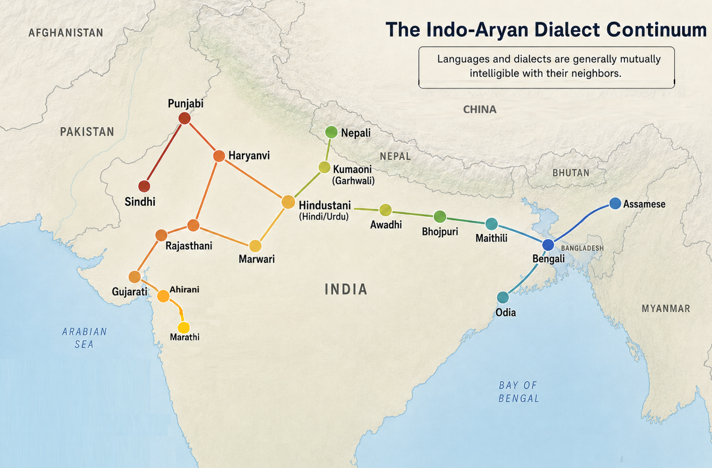

# What makes a language?

Since linguistics is the scientific study of language, you can't really do that without knowing what a language is. A lot of this content will overlap with a field of linguistics called sociolinguistics, but this is more on the philosophical side. 

Most people would agree that a language is a system to communicate with others. 

Natural languages (natlangs) like English, French, Hindi, Korean, and Quechua are what most people think of when they think about languages, and they can express most things that the speakers find relevant, usually including abstract thought. Constructed languages (conlangs), like Klingon, Esperanto, Ithkuil, Toki Pona, and Sindarin, though they didn't develop naturally, are typically able to do the same things. 

## Programming languages

What about programming languages? They allow people to directly communicate with computers (besides speaking in English to LLMs, which some view as a 5th generation programming language). You can tell the computer how to do a sorting algorithm (though you must give it every single detail, which is a constraint not really present in natural languages), but you can't really ask it how the weather is, while using, say, Python. However, a computer doesn't really communicate back to you, apart from maybe the program's output (which still isn't in that programming language), so it's not really a language in the same sense as a natural language. It's also kind of weird when sometimes, you're telling the computer how to interact with another user. I think most people would agree that programming languages are, in some ways, languages.

## Animals

And what about when a dog barks for different emotions, like if it doesn't recognize someone or if it's hungry? You might argue that it's not, because the barking just points to whatever is going on, so the communication is dependent on whether the thing being talked about is physically present, which is not the point of language. However, barking could just be a very limited language, similar to how programming languages are also limited.

## DNA and more

Would any sort of code also be a compiler for a language? For example, you could think of the genetic code as a way to translate every three nucleotides of DNA to a protein, and in that sense, DNA is almost like a programming language because it dictates what proteins to make. I'll probably write a blog post about this in more detail in the future. There's even a NACLO problem, [Sk8 Parsr](https://www.naclo.org/resources/problems/2009/N2009-G.pdf), about a "language" used to represent a video game. 

## How about what makes different languages?

The introduction of the book "The Art of Language Invention" by David J. Peterson goes over the different types of languages in a lot more depth. For the purposes of this blog post, I'm going to stick to natlangs, because that's where most of the tension is (there isn't much *physical* hostility between C and C++ users or anything). 

Just getting a baseline definition of what a language is already causes so much disagreement, just wait until you argue about whether languages are distinct or not, which is what we're going to talk about for the rest of this blog post. 

# Mutual Intelligibility

Usually, two languages are said to be the same language if they are *mutually intelligible*, which means speakers of one language can understand speakers of the other language for the most part. Since American and British English are similar enough to be mostly understood by each other, they're considered the same language.

However, this has some problems. How intelligible is intelligible enough for two languages to be the same, and wouldn't making such a line be subjective and arbitrary? Also, what intelligibility score would you use? 

## Lexical Similarity

For the second question, you might suggest using *lexical similarity*. This is when you take a large list of vocabulary between two languages, and find the percentage of vocabulary where both languages use cognates. However, lexical similarity can't really dictate mutual intelligibility. For example, French and Italian have an 89% lexical similarity, but the words in common are pronounced very differently - "mangiare" and "manger", both meaning "to eat", might be unrecognizeable in speech. Another issue is that in writing, the vocabulary would be a lot more recognizeable, which might lead us to inconsistently group languages based on the medium they're present in. 

## Understanding

Maybe instead of having a metric based on the language, you can have a metric based on individuals instead. If you take speakers of two languages, you can make them listen to a short story in the other language, and then quiz them on what happened. The main problem with this is that it's hard to define what would make a good story to test speakers on. As a result, judging intelligibility is usually going to be a qualitative phenomenon, because there's not a single good way to measure it quantitatively. 

## Asymmetric Intelligibility

There is also asymmetric mutual intelligibility. Danish sounds a lot different from Swedish and Norwegian, because its phonology is a lot more complex and it's evolved differently. So, Danish speakers can understand Swedish and Norwegian speakers pretty well, because the grammar (apart from the phonology) is very similar, and the vocabulary is too. However, Swedish and Norwegian speakers cannot understand Danish speakers because they don't understand their accent. 

It's a very similar situation for Portuguese and Spanish too, where it's much easier for Portuguese speakers to understand Spanish than the other way around. Asymmetric mutual intellibility really points out a major flaw of using mutual intelligbility as a criteria for distinguishing languages. If Portuguese speakers understand Spanish but not the other way around, then you might say "Portuguese is the same language as Spanish" but "Spanish is not the same language as Portuguese". However, that clearly doesn't work out logically. 

## Ciphers?

As a side note, would Pig Latin be considered part of English or not? Pig Latin, if you didn't know, is when you take each English word and apply a rule to it. If it starts with a vowel, you add "y" or "w" to the beginning, and then apply this next rule. If it starts with a consonant (all words at this point will), you move it to the end and add "ay" after that. 

Technically, the lexical similarity is 100%, because all words from Pig Latin are derived from English. However, if someone is talking to you in Pig Latin, you'll likely not understand anything they say unless you know or figure out the cipher. Linguists don't really deal with ciphers that much, so they don't need to worry about this problem, but mathematicians do, because it's part of cryptography. 

## Dialect Continuums

Even if you do come up with a good enough way to measure mutual intelligibility, and you say whether any two languages are mutually intelligible or not, and therefore are the same language, that still leaves a giant issue.

Languages inherently have at least minor variation from one location to the next, because the people are different and therefore speak a different dialect (if you break it down further, it comes down to idiolects, which we'll talk about soon). 

A dialect is just the form of a language from a specific group of people, whether that is naturally based on geography (like Scottish vs. Nigerian English) or social groups (like brainrotted gen alphas vs. college professors). Everyone has a dialect, because everyone's version of their language is slightly different. 

Look at the Indo-Aryan languages. Sometimes they are classified under what Prakrit (once Sanskrit started evolving, it split up into Shaurasheni Prakrit, Magadhi Prakrit, and Maharashtri Prakrit) they evolved from, but it's not really a clean divide like that, since they constantly have been in contact with each other. It's more accurate to call them a dialect continuum. 

{.lightbox}.

Note that adjecent points aren't necessarily that mutually intelligible, because to draw a true dialect continuum where one point has no issue communicating with another point, the diagram would be very very very cluttered. However, you can still see how hard it is to define what a language is in this case. Here's a bit more explanation.

Someone in Punjab will definitely understand someone from a neighboring village a little further East, and that person will be able to understand someone else from another village even more to the East, and so on, until you eventually get to Bangladesh. However, it's clear that Punjabi and Bengali are not intelligible in the slightest. Adjacent villages speak the same language, according to the mutual intelligibility criterion. However, that would lead to the conclusion that Punjabi is the same language as Bengali, which, looking at their genetic relationship, is like saying French is the same language as Romanian - it's simply not true. Therefore, the problem of dialect continuums hints at the idea that there must necessarily be some minor variation of language as it spreads across geography, and you can't say that any two varieties are the same, identical language.

## Language Evolution

Just as language varies across space, it also varies across time. For example, take this excerpt from the Old English text Beowulf:

"Hwæt. We Gardena in geardagum,
þeodcyninga, þrym gefrunon,
hu ða æþelingas ellen fremedon.
Oft Scyld Scefing sceaþena þreatum,
monegum mægþum, meodosetla ofteah,
egsode eorlas. Syððan ærest wearð
feasceaft funden, he þæs frofre gebad,
weox under wolcnum, weorðmyndum þah,
oðþæt him æghwylc þara ymbsittendra
ofer hronrade hyran scolde,
gomban gyldan. þæt wæs god cyning."

If you're a regular human being, and not some group of extraterrestrials that's been spying on humanity ever since it built the pyramids of Giza, chances are that you have no idea what that just meant. 

In modern English, here is the translation of that text:

"So. The Spear-Danes in days gone by and the kings who ruled them had courage and greatness. We have heard of those princes’ heroic campaigns. There was Shield Sheafson, scourge of many tribes, a wrecker of mead-benches, rampaging among foes. This terror of the hall-troops had come far. A foundling to start with, he would flourish later on as his powers waxed and his worth was proved. In the end each clan on the outlying coasts beyond the whale-road had to yield to him and began to pay tribute. That was one good king."

This probably still doesn't make much sense to you, unless you study extremely boring subjects too much, but the point is that at least you understand what most of the words mean, and the syntax makes sense to you. 

Old English was VERY different from modern English. Its grammar was closer to modern German. Morphologically, both have three genders and four cases - much richer synthetic morphology than modern English, which is much more analytic (if you don't know what that means, read my blog on [morphology](https://vaishnavs.net/posts/Morphology)). Syntactically, Old English and German both have extra verbs go to the end of a sentence. For example, in German, "I must want to have a dog" is "Ich muss einen Hund haben wollen", or literally, "I must a dog to have to want", which would sound nonsensical to an English speaker. Similarly, Old English does the exact same thing.

So at what point did the language spoken in England stop being Old English and start being modern English? Kids of one generation always spoke just slightly differently from their parents, but they still had basically no problem communicating. Even when a bunch of vocabulary from Norman French was borrowed into English, it was pretty gradual, and parents would never have thought they were speaking a different language from their kids. There's not a single line you can draw that says, "aha, anything spoken before this year must be Old English, and anything spoken *after* that year must be modern English!" Even if you define modern English to be however far back you can still understand, the problem remains that "understanding" isn't a binary. Your language isn't even 100% identical to that of your peers, and it's not like Old English is 0% intelligible either, so defining a line is still arbitrary.

# Role of Politics, Nationalism, and Standardization

Lots of times, countries have the need for a national identity so that they will remain unified. A really strong way to do this is to make all the citizens feel like they have the same culture, and that other countries have different cultures, and a really strong indicator of culture is language. So, if a country says "we are the sole speakers of this language, and this other country speaks a separate language", then their national identity will likely be much stronger.

One example of this is how Hindi and Urdu are considered separate languages today. When India and Pakistan split, they both wanted to have a secondary national language apart from English. Hindi and Urdu are both just varieties of the larger [Hindustani](https://en.wikipedia.org/wiki/Hindustani_language) dialect continuum (it's sometimes considered a single language too - I know this entire blog post is about how defining what makes a language distinct is very hard, but their spoken forms are much closer than, say, Canadian and Senegalese French, which are considered a single language). 

Hindustani as a dialect continuum existed before the partition of India and Pakistan and was spread out on both sides of the modern border. So, if you ignore politics, there shouldn't be any reason to say that the language spoken one millimeter into the Indian side is the same language as the one spoken way way way inland, but it's a different language from the one spoken one millimeter into the Pakistani side. 

Hindi and Urdu are basically mutually intelligible colloquially, but their formal written forms are very different - for one, they use completely different orthographies, so the speaker of one can't read a single word of the other. 

Standardization allows for national languages to make themselves distinct. Formal Hindi, which is emphasized in Indian schools, takes a lot more modern borrowings from Sanskrit vocabulary, while formal Urdu, which is emphasized in Pakistani schools, has a lot more Persian and Arabic loanwords. So, while speakers of either language can understand each other when speaking colloquially, their respective governments tried to make the standard forms diverge more.

# Idiolects and Code-Switching

Right now, we've seen how languages can differ through space and time. However, it can also vary at an individual level too.

## Variation among individuals

Even people who are very close have some differences in their internal grammars.

For example, me and my sister disagree on what the answer to this question is:

The group of aliens (was/were) evil.

I say "was", because I reduce the entire noun phrase to just "group" (which means I have an advantage for the SAT because my brain works similarly to that of the prescriptivists), but my sister says "were", because she sees "aliens" next to "were". 

Despite adhering to the rules of standard English decently well, I also differ from it. Usually, you're expected to say "if I were to". However, my internal rules say that "I" and "were" can't go together unless the "I" is part of something plural, which in this case it is not. Standard English suggests that the rule for making the subjunctive overrides a singular going with "were", but for me, a singular can never go with "were" no matter what, and this overrides any other rules. This gets into something called Optimality Theory, which may be a future blog post.  

This just goes to show that because everyone's brain works slightly differently, their internal grammars differ as well. Each individual's way of speaking is called an *idiolect*.

## Variation within individuals

One person can also have many different ways of speaking within themself. If you're talking to your friends, it might be ok to omit the copula and say, "whatcha doing", which without the palatalization sandhi is "what ya doing". However, in a professional environment, you're expected to say "what are you doing". This is quite literally a different set of phonological and morphosyntactic rules, albeit very similar. So, you could say that these are different languages, because, as we've seen, it's very hard to draw a line for how similar two sets of rules must be to say they're the same language. 

The practice of changing the way you speak depending on the context is called *code switching*. 

# My own solution 

So, we've seen the complications of defining and distinguishing languages, and it's still not entirely agreed on by linguists. So, let's see how I personally solve this dillema.

I think that everyone has their own languages that just overlap similarly enough to be able to communicate. There's no point in asking if my English is the same as your English, because the answer will always be no. Even if we understand each other perfectly, because our differing rules won't necessasrily take away from understanding, we both may still have a different idea of what certain words refer to exactly. This distorts the meaning by a nonzero amount, but usually the meaning being distorted isn't the main point being made, so it doesn't matter. Defining English is like defining a game, because it could be a family resemblance (for more information, read my upcoming semantics blog) - instead of a single unifying feature, it's just a network of languages that have close connections to some of the others, but not all. 

Your own language is also continuously changing - for example, you can say the same word over and over again, and there will always be very slight phonetic differences, since frequency is a real number, not a discrete quantity like rules, so it's nearly impossible to replicate exactly. Obviously, this is a terrible and nitpicky example. A better example is how your language always gets shaped by other people. When I was new to Discord, I used to always use the actual laughing emoji to indicate that something was funny, but then I saw that others used the skull emoji in that same context, so I started to use that instead.

Mutual intelligibility is relative. Even though that there's not a specific metric that can perfectly quantify it, people can generally tell how well they understand other languages. It's definitely not a binary - even though you might understand 0% or 100% of some text, these are just the extreme cases. 

The specific language that someone speaks is a function of them, their audience, and the occasion. Obviously, a language can't just be based on a single person, because the point of it is to communicate with someone else. Even if you speak multiple "different" languages (as in, not thought of as English, and very little intelligibility, such as French), your brain still can choose this - you'll only speak French to another person who knows French, but you probably won't speak it to a random person in the USA who may or may not know French. And maybe if in the exact same occasion and audience, you could speak in two different ways (like speaking to someone in your French class in English, because they can converse with you in either), the way of choosing this is more conscious than subconscious, but maybe you can consider the conscious decision as part of the occasion too. 

If everyone speaks multiple languages, then how do you define multilingualism? I'd say that for most people who only speak a variety of English, the differences are too negligible to say that you speak 50 languages. When accounting for code switching, you should only count changes that alone are unintelligible. So, the total languages I speak between my sister and my friends would only be 1.001 or something very close to 1, because only a small amount of vocabulary, pronunciation, and grammar is different. Now, if I hypothetically speak only standard English and standard Chinese, that should count as almost 2 languages, maybe 1.998, because Chinese and English have almost no vocabulary in common (shared word order shouldn't really count for intelligibility if none of the vocabluary or genetic relationship is common), apart from the very few loanwords that exist. If I speak hypothetically only standard English and standard German, that would maybe be 1.7 languages or something like that. 

There must in theory be some metric to measure mutual intelligibility that can fit this criteria, even if it's hard to actually compute. I think this really is the problem with distinguishing languages. If there is a real, objective score for saying how different two languages are, then our problem is solved! However, for now, this is still based on vibes, so we can only say that they are not the same language. 

# Conclusion

As you can see, there are many complications when it comes to defining a language. If you disagree with my solution to this issue (which you likely will), please write your interpretation in the comments, because different opinions will be very cool. 
