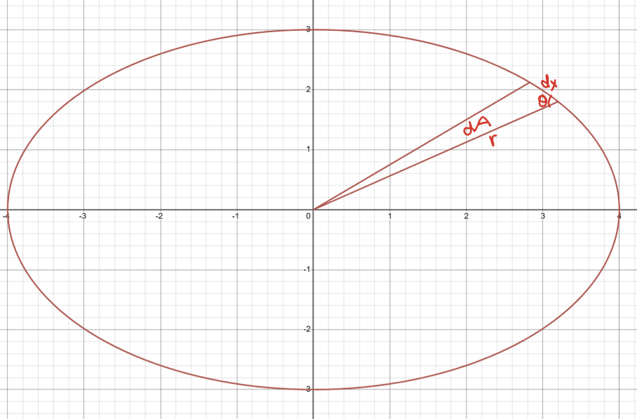

# Introduction

Usually when you learn the laws of physics, it's something that instantly makes sense. The first law of thermodynamics is that energy is conserved, duhhh! Newton's second law is that $F_{net} = ma$, duhhh! But then Kepler's second law is that when planets are in orbit, which are usually eliptical, the area is swept out at a constant rate. Huhhh? That sounds so random! However, there is a pretty nice reason for why this is.

# Proof

Basically, what we seek to prove is that $\frac{dA}{dt}$ is constant, where $A$ is the area swept out by the planet. 

{.lightbox}.

First, we need to find $dA$, a tiny change in the area swept out, in relation to the other tiny changes like in position or time. The planet is moving in an ellipse, so the distance from the center keeps on changing. For a tiny change in position $\vec{dx}$, the distance from the center has barely changed, and we can call this distance $\vec{r}$. The reason for this is because the new distance is $\vec{r} + d\vec{r}$, but since $d\vec{r}$, the change in the radius, is infinitesimal, this is the same as $\vec{r}$. 

$\vec{dx}$ is basically the length of the arc made by this tiny change in time, because the curve is zoomed in so much that it looks like a straight line. The area $dA$ formed by this sector, which is approximately a triangle with two of the side lengths being $|\vec{r}|$ and $|\vec{dx}|$, is $\frac{1}{2} |\vec{r}| |\vec{dx}| \sin(\theta)$, where $\theta$ is the angle between $\vec{r}$ and $\vec{dx}$. This is just a basic formula in geometry for the area of a triangle given two sides and the angle between them. You might realize that this is the same as $\frac{1}{2} |\vec{r} \times \vec{dx}|$. This is because the area of the parallelogram formed by two vectors is the magnitude of their cross product, and the area of this triangle is half of that.

Because $\vec{dx} = \vec{v} dt$, where $\vec{v}$ is the velocity of the planet, and also $dt$ is a scalar (which means we can remove it from the magnitude), we can substitute this in to get $dA = \frac{1}{2} |\vec{r}| |\vec{v}| dt \sin(\theta)$, so $\frac{dA}{dt} = \frac{1}{2} |\vec{r}| |\vec{v}| \sin(\theta)$. Similar to $\vec{r}$, $\vec{v}$ doesn't change after an infinitesimal change in time $dt$, because again, $\vec{v} + d\vec{v}$ is infinitesimally close to $\vec{v}$. 

Remember that the angular momentum $L$ is defined as $L = m \vec{r} \times \vec{v}$, where $m$ is the mass of the planet. So, $|L| = m |\vec{r}| |\vec{v}| \sin(\theta)$

We can substitute this in to get $\frac{dA}{dt} = \frac{|L|}{2m}$.

Because angular momentum is conserved, and the mass is constant, $\frac{dA}{dt}$ is constant, which is what we wanted to prove.

# Conclusion

Now we know where Kepler's second law come from, and stay tuned for more physics and astronomy derivations!