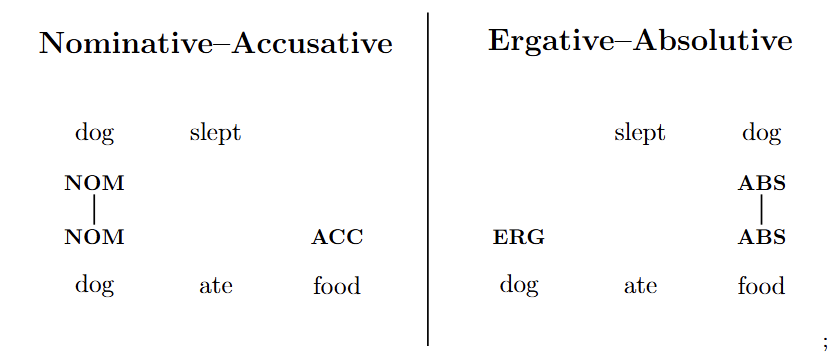

# Introduction

How do different languages organize words and how they relate to each other? If you have read [morphology](https://vaishnavs.net/posts/Morphology/) and [syntax](https://vaishnavs.net/posts/Syntax-Part-1/), you might realize that this question can't be answered from either one in isolation - they must merge here to be answered. So, let's get into it. 

# Word order 

The most basic way to figure out how words are arranged is how the following sentence would be ordered in a language:

"I like [the] blue book".

If you have a single brain cell, you probably know that "I" is the subject, "like" is the verb, and "blue book" is the object. 

If you have two brain cells, you probably know that there are three elements here (treating "blue book" as a single unit), so the number of ways to rearrange this is $3! = 6$, namely SVO (English), SOV (Tamil), VSO (Arabic), VOS (Proto-Zorbbbb), OVS (Klingon), and OSV (Yoda) (notice how we went from real languages to aliens???)

If you have three brain cells, you probably know that if you additionally allow "blue" and "book" to switch places, then there are $2! \cdot 3! = 12$ orderings. English says "the blue book", while French says "le livre bleu", or "the book blue". 

I apologize for the unprovoked parallelism, this has no intended poetic effect, I promise. Also, remember not to learn neuroscience from me, because a single brain cell isn't enough to understand morphosyntax. 

These are the very basic factors that are pretty much universal (cough cough Craftic without any objects). However, you can also worry about prepositions or postpositions (whether that sort of particle comes before or after the noun - in English, you say "to the house", but in Hindi, you say "ghar ko", or literally, "[the] house to"), and a bunch of other orderings.

Recall from [Syntax Part 1](https://vaishnavs.net/posts/Syntax-Part-1/) that these orderings are all part of a larger concept called head-directionality. 

Anyway, I want to talk about is how analytic and synthetic languages differ with how free their word order is. 

Analytic languages don't inflect for stuff like case, and case is what determines the relations between the nouns in a sentence. Because syntactic roles are not marked on nouns, word order is what determines that, so analytic languages have strict word order. You can say "the guy sees the city", but if you say "sees the city the guy" or "the city sees the guy", it would either sound ungrammatical or nonsensical. 

Meanwhile, synthetic languages have a lot more inflection, including case oftentimes. Because the nouns already have a morpheme attached that indicates what syntactic role they play, word order isn't as important. That same sentence in Sanskrit would be "purushah nagaram pashyati", or /pʊɾʊʃəhə n̪əgəɾəm pəʃjət̪i/, naturally. However, any order would have been grammatical to most speakers, because even if someone said "nagaram pashyati purushah", the case endings still indicate that it's the guy who did the seeing and the city was the thing being seen. As a result, while there is a naturally preferred word order, the redundancy it gives doesn't need to exist for the sentence to be understood, so any order is fine. 

# Nouns

Now, we'll get into how nouns and verbs, the parts of speech that are the most universal, work cross-linguistically. With just a noun and a verb, you can already make a lot of sentences, like "I slept" or "you eat".

Let's start with nouns - you learned it in school as "a person, place, thing, or idea", which basically sums it up. The only problem I have with this is that I would put all of it under "entity". Otherwise, it's probably too narrow. The word "dog" is indisputably a noun, but it's not a person (usually refers to humans), or a thing ("things" are considered inanimate, at least to me), or a place (though that's semantically vague if you think about it so *maybe*?), or an idea (dogs are not abstract). 

Anyway, that was just my tangent - use "entity" to not open up a can of worms. But hey, if "person, place, thing, or idea" encompasses all nouns in your idiolect through non-compositional semantics (since the reference isn't completely literally derived from its parts), then go for it - who am I to be a prescriptivist?

You can also define nouns syntactically, rather than semantically. It's simply a type of constituent category $NP$ that satisfies properties IN ENGLISH such as $S \to NP \ \ VP$, $NP \to Adj \ \ NP$, $PP \to P \ \ NP$, etc. You might analyze it differently in other languages. 

## Cases

We've already seen how the presence of a case system affects how free the word order of a language is, but let's get into cases themselves.

A language with cases usually has morphemes attached to nouns for the following roles:

* Subject (what does the action)

* Object (what the action happens to)

* Various prepositional roles, which I put stuff like genitive (possession), dative (what receives the action), and vocative (addressing the audience) under as well, and it also includes more obvious prepositional stuff like locative (where something is) and ablative (where something comes from).

For example, let's look at the Sanskrit example again - "purushah nagaram pashyati". The "ah" morpheme represents the masculine nominative case, and the "am" morpheme represents the neuter accusative case (we'll get into the nuances behind nominative and accusative very soon). 

If you instead wanted to convey the nonsensical sentence "the city sees the guy", you would have to change the cases, because as we've seen previously, word order won't change the meaning. In this case, (changing the word order to OSV instead of SOV so we can just observe the case change) it would be "purusham nagaram pashyati". The "am" morpheme is also for the masculine accusative case AND the neuter nominative case. Even though the case of "nagaram" may be ambiguous on its own, we can find out that "purusham" is in the accusative case, which means the former must be nominative. 

Now, suppose you wanted to say "the guy sees the city with the dog". The "with the dog" part would use the instrumental case. The nominative case for "the dog" would be masculine, so "kuttah". In the masculine instrumental case, you would use the morpheme "eṇa" plus the postposition "saha", so "with the dog" would be "kutteṇa saha", or /kʊtteɳə səhə/. The whole sentence would be "purushah kutteṇa saha nagaram pashyati".

## Grammatical classes

Nouns in many languages are put into different grammatical classes. Nouns from different classes usually behave differently - they may be given separate affixes attached to them, separate verb endings, or separate articles. 

There are a few different ways nouns are classified. 

### Grammatical genders 

One, which you have probably seen if you ever learned Spanish or French, is to place males and females (this literal biological distinction in languages usually applies to people and sometimes to other animals) into separate categories, and inanimate things can go in either depending on the noun. 

Note that these are called "genders" because it's much easier to remember that in French, the words for "boy" and "girl" are in different categories (*le* garçon and *la* fille, respectively), than it is to remember that "Japan" and "China" (*le* Japon and *la* Chine) are, for example. The term "gender" was given before linguists encountered languages with different types of classes. 

The classification of inanimate nouns has nothing to do with whether they have XX or XY chromosomes, because they don't even have chromosomes. It might not even apply to humans. In German, "the girl" is "*das* Mädchen", which is in the neuter gender, not "*die* Mädchen", as feminine nouns would be be marked. 

Most languages with sex-based grammatical classes mark either a two-way masculine/feminine distinction (like Hindi or French), or a three-way masculine/feminine/neuter distinction (like German or Sanskrit). 

### Animacy-based grammatical classes

Another way to categorize nouns is to use animacy instead. This can be observed in the plural morphemes of Cree:

The singular for "dog" is "atim", and the plural is "atimwak", with the animate morpheme "wak". Meanwhile, the singular for "hat" is "astotin", and the plural is "astotina", with the inanimate morpheme "a". 

There is also something called an animacy hierarchy in some languages. Instead of just simply "animate" and "inanimate", some nouns are more animate than some other nouns but also less animate than others too. Even speakers in the conversation are considered more animate than speakers outside of it. This also affects word order - more animate nouns must come first, and only then the more inanimate ones. This phenomenon is famously present in Navajo. In English, this would be like if "the cat saw me" was ungrammatical, so you must say "it was me who the cat saw". 

### Other

The Bantu languages have a different system, where nouns are grouped semantically. 

Look at this data for the following nouns:

|English       |Swahili  |
|--------------|---------|
|Kenyan person |Mkenya   |
|Chinese person|Mchina   |
|Kenyan people |Wakenya  |
|Chinese people|Wachina  |
|Person        |Mtu      |
|People        |Watu     |
|Knife         |Kisu     |
|Knives        |Visu     |
|Book          |Kitabu   |
|Books         |Vitabu   |
|Beauty        |Uzuri    |
|Culture       |Utamaduni|
|Poverty       |Umaskini |
|Eye           |Jicho    |
|Eyes          |Macho    |
|Stone         |Jiwe     |
|Stones        |Mawe     |

Look specifically at common prefixes. You'll notice that from this data, we have classes for people, for objects, for abstract concepts, and for this weird class involving eyes and stones (likely doesn't make sense for English speakers). These prefixes also change for number with fusional morphology (so instead of adding a plural morpheme, the class prefix changes form). These classes don't seem to be based on solely gender or animacy (but the latter is partially a factor), but rather on semantic categories. 

### Origin 

One reason for why grammatical classes exist is to add a bit of redundancy in environments where a listener may miss a word being said. In English, if someone says, "the house is good", but you don't hear the word "house", then the noun could be almost anything. However, in French, if someone says the same thing, "la maison est bonne", then the number of possible nouns narrows to only 42% of the original amount, because "la" and "bonne" indicate that the noun is feminine. 

Additionally, it's just easier to group stuff semantically. If the topics of people's conversation have certain very common themes, wouldn't it be easier to mark that grammatically so they would have slightly more cognitive space to talk deeper about that theme instead of having to first identify it through context? This is especially true for the Bantu system. 

Usually, there is a default class. For genders, this is typically neuter, if it exists, or masculine (yeah, I know it's sexist). For the semantics-based class system, there's usually a designateed class for "other". 

## Grammatical number

Another thing that nouns can be marked for is number. Since languages tend to be much older than major mathematical developments, the distinctions might seem somewhat primitive. 

Most languages that distinguish number have singular and plural (one vs. not one). Isn't that weird? You can see one dog, two dog*s*, zero dog*s*, or $\pi$ dog*s* (grammatically, that is - I hope that last one isn't literally happening because I'd feel bad for that almost one seventh of a dog). And I guess $i$ dog*s* too, but again, that's only how your brain subconsciously inflects the noun, not because this makes any sense at all. Instead of splitting them into categories which both have infinite values, one category has $1$ possible value, while the other has $2^{\aleph_0}$ possible values - what an imbalance, huh? 

# Verbs

Verbs are the other part of speech that is almost universal. They are usually semantically defined as "actions, states, or occurrences". I mean I guess - depends on how far you stretch this. A less ambiguous and more mathematically rigorous way, with syntax, is to define verbs as a type of constituent category $VP$ in English with properties such as $VP \to VP \ \ PP$, $VP \to VP \ \ Adv$, $S \to NP \ \ VP$, etc. Again, this isn't a very *universal* definition, but you can do an analogous thing in other languages. Universally, it's just a type of syntactic category with certain properties. 

## Valency

Valency is how many arguments a verb takes. An *argument* is basically an $NP$ that is mandatory within a version of a verb. This is a superset of transitivity, too - focusing on objects, such as direct and indirect. In English, the subject is always mandatory, making the valency usually one more than the transitivity. 

The sentence "I ate" is ambitransitive. It can either have a valency of $1$, which makes a verb where only the subject matters. Or it can have a valency of $2$, where in that version of the verb, something has to be eaten too. 

It gets confusing because you might think anything that can have a case for it is an argument. However, it depends on what's actually necessary for that version of the verb. For "I ate food in the house", the "ate" will never care about *where* it's being eaten - not in any version of the verb. The $PP$ "in the house" is considered an adjunct, not an argument, because the universe will not collapse from a void in semantic space. 

Now, if you remove "food", the sentence is still grammatical, right? Wouldn't that make it an adjunct? However, that is just because the "ate" basically becomes a new word, "ate", with the same form but slightly different semantic meaning and syntactic behavior. Whether something is an adjunct or an argument of a new word depends on the semantic analysis. 

In English, a verb's valency is among $\{0, 1, 2, 3, 4\}$. 

| Valency | Example    | Explanation                                                                     |
|---------|------------|---------------------------------------------------------------------------------|
| 0       |"It rains"  |It might seem like "it" is an argument, but semantically, it is a dummy argument.|
| 1       |"I sleep"   |The only thing involved is "I".                                                  |
| 2       |"I eat food"|The subject and the object are both arguments.                                   |
| 3       |"I give you stuff"|The dative "you" is now introduced.                                        |
| 4       |"I bet you $5 on the game"| Some analyses include "on the game" as an argument.               |

## TAM

TAM stands for tense, aspect, and mood. 

### Tense

Tense is when the action happens. English has past, present, and future. This might be a suffix (like "-ed" in English for past), an auxiliary verb (like "will" in English for future), or a separate optional time word (like "kemarin" for "yesterday" in Indonesian, which otherwise doesn't have tense morphology). 

Tense can also combine these. In French, for the default past tense, known as the *passé composé*, you must conjugate the auxiliary verbs "avior" or "être" (meaning "have" and "be" respectively) in the present tense, and then add a verb form which, in the regular form, is like the infinitive but with a suffix like "-é", "-i", or "-u" rather than the infinitive endings "-er", "-ir", or "-re", depending on the verb.

I talk more about the semantics of tense in [semantics](vaishnavs.net/posts/Semantics/), but this just shows briefly how it is expressed morphosyntactically.

### Aspect

Aspect is how the action unfolds within a time frame. It's kind of hard to formalize, but you usually understand it subconsciously. Compare "I will be leaving" versus "I will leave" versus "I will have been leaving" versus "I will have left". It's weird, but you probably get what I mean. 

### Mood

Mood is how a verb expresses the speaker's emotion or intention about the action. Others might yell at me, but I'm gonna group modality and evidentiality under mood too, since they're similar. 

The indicative mood is usually the default, which just states a fact, like "I exist". The interrogative asks a question, like "Do you exist?". The imperative gives a command, like "Exist!". There are a lot more too, like conditional, subjunctive (hypothetical), and more. One especially cool mood is the admirative, which is a separate morphological form just for how surprised you are, like in Balkan languages. 

Evidentiality (also in Balkan languages) is a form that indicates where the speaker got their information from - first-hand, second-hand, heresay, etc. If you saw something directly in Turkish, you would say "geldi", but if you heard about it from someone else, you would say "gelmiş" (Turkish also has vowel harmony, making muş an allomorph of this). 

## Agreement

# Alignment

Alignment is related to the concept of noun cases, but all languages, even those without cases, have alignment, where the grammatical roles are expressed through a rigid word order instead of case affixes.

In a transitive sentence, verbs have a valency of at least two - the subject and the object, like "the dog ate food". In an intransitive sentence, verbs have only one argument, like "the dog slept". Alignment is basically whether the "dog" in "the dog slept" is treated like the "dog" or the "food" in "the dog ate food". 

## Nominative-Accusative

Since English shows cases with word order, and the subject comes before the verb, we know that English treats the argument of intransitive verbs the same as the subject of transitive verbs. This is called nominative-accusative alignment. 

## Ergative-Absolutive

Now look at the same sentence in Hindi. "The dog ate food" would be "kuttane khana khaya", or /kʊt̪t̪an̪e kʰan̪a kʰaja/, and "the dog slept" would be "kutta soya", or /kʊt̪t̪a soja/. See what happened? The suffix "ne" was only added to the subject of the transitive sentence, while the argument of the intransitive sentence was treated the same as the object of the transitive sentence by not adding any suffix. This is called ergative-absolutive alignment. 

## Split-Ergativity

Do you recall that we saw Sanskrit use the nominative and accusative cases? Hindi is a descendant of Sanskrit, so why would it be an ergative-absolutive language? Well, it's actually only ergative-absolutive in the simple past tense. In the present tense, for example, Hindi would work the same as English, treating the subject of a transitive sentence like the argument of an intransitive one (using word order, not case morphemes). When a language uses nominative-accusative alignment in some contexts and ergative-absolutive alignment in others, this is called *split-ergativity*. 

## Tripartite 

There's also a third alignment. Instead of aligning the argument of an intransitive verb with either argument of a transitive verb, the intransitive argument gets its own marker. An example of this is from the conlang Na'vi from the movie Avatar (the one about aliens, not airbenders). The word for "viperwolf" is "natang" when it's used in an intransitive sentence, "natangìl" when it's the subject of a transitive sentence, and "natangt" when it's the object of a transitive sentence. 

## Visualization

{.lightbox}

Note that the word order doesn't literally have to change, that's only a way to show how the nouns align. For example, if these relations are marked by case, then the word order would be free. 

# Movement

# How different languages classify parts of speech 

# Conclusion

# Further Information

* The statistic that 42% of French nouns are feminine comes from [here](https://universaldependencies.org/treebanks/fr_ftb/fr_ftb-feat-Gender.html?).

* The Cree animacy example is from [this course](https://socialsci.libretexts.org/Courses/Canada_College/ENGL_LING_200%3A_Introduction_to_Linguistics/04%3A_Words-_Morphology/03%3A_Morphemes). 